# GarapaSystem

**Versão:** 0.1.34

Sistema integrado de gestão empresarial desenvolvido com Next.js, TypeScript e Prisma, oferecendo funcionalidades completas para gerenciamento de clientes, tarefas, helpdesk e webmail.

## 🚀 Funcionalidades Principais

### 📋 Sistema de Tarefas
- Criação e gerenciamento de tarefas
- Dashboard com visualização de tarefas
- Calendário de tarefas
- Sistema de comentários e anexos
- Recorrência de tarefas
- Notificações em tempo real

### 🎫 Helpdesk
- Sistema completo de tickets
- Gerenciamento de departamentos
- Automação de tickets
- Sincronização com email
- Logs de atividades

### 👥 Gestão de Clientes
- Cadastro completo de clientes
- Histórico de interações
- Integração com sistema de tarefas
- Endereços e informações de contato

### 📧 Webmail
- Interface de webmail integrada
- Sincronização com servidores IMAP
- Composição de emails
- Configuração de contas de email
- Permissões granulares

### 👤 Gestão de Usuários
- Sistema de autenticação
- Perfis e permissões
- Colaboradores e hierarquia
- Grupos hierárquicos

### 🔧 Administração
- Configurações do sistema
- Chaves de API
- Webhooks
- Logs do sistema
- Documentação Swagger

## 🛠️ Tecnologias Utilizadas

### Frontend
- **Next.js 15.3.5** - Framework React
- **TypeScript** - Tipagem estática
- **Tailwind CSS** - Estilização
- **Radix UI** - Componentes acessíveis
- **React Hook Form** - Gerenciamento de formulários
- **Socket.IO Client** - Comunicação em tempo real

### Backend
- **Node.js** - Runtime JavaScript
- **Prisma** - ORM para banco de dados
- **PostgreSQL** - Banco de dados
- **NextAuth.js** - Autenticação
- **Socket.IO** - WebSockets
- **Nodemailer** - Envio de emails
- **ImapFlow** - Sincronização IMAP

### Infraestrutura
- **PM2** - Gerenciamento de processos
- **Docker** - Containerização
- **Redis** - Cache e sessões

## 📦 Instalação

### Pré-requisitos
- Node.js 18+
- PostgreSQL
- Redis (opcional)

### Configuração

1. **Clone o repositório**
```bash
git clone <repository-url>
cd GarapaSystem
```

2. **Instale as dependências**
```bash
npm install
```

3. **Configure o banco de dados**
```bash
npm run db:push
npm run db:seed
```

4. **Configure as variáveis de ambiente**
Crie um arquivo `.env` baseado no `.env.example`

## 🚀 Execução

### Desenvolvimento
```bash
npm run dev
```

### Produção com PM2
```bash
npm run build
npm run pm2:start
```

### Scripts Disponíveis

- `npm run dev` - Inicia o servidor de desenvolvimento
- `npm run build` - Gera build de produção
- `npm run start` - Inicia servidor de produção
- `npm run pm2:start` - Inicia com PM2 (seguro)
- `npm run pm2:stop` - Para processos PM2
- `npm run pm2:restart` - Reinicia processos PM2
- `npm run pm2:logs` - Visualiza logs do PM2
- `npm run pm2:status` - Status dos processos

### Banco de Dados
- `npm run db:push` - Aplica schema ao banco
- `npm run db:generate` - Gera cliente Prisma
- `npm run db:migrate` - Executa migrações
- `npm run db:seed` - Popula dados iniciais

## 🏗️ Arquitetura

### Estrutura do Projeto
```
├── src/
│   ├── app/                 # Páginas e rotas da aplicação
│   │   ├── api/             # Endpoints da API
│   │   ├── auth/            # Páginas de autenticação
│   │   ├── clientes/        # Gestão de clientes
│   │   ├── helpdesk/        # Sistema de helpdesk
│   │   ├── tasks/           # Sistema de tarefas
│   │   ├── webmail/         # Interface de webmail
│   │   └── ...
│   ├── components/          # Componentes React
│   ├── hooks/               # Custom hooks
│   ├── lib/                 # Utilitários e configurações
│   └── types/               # Definições de tipos
├── prisma/                  # Schema e migrações do banco
├── public/                  # Arquivos estáticos
└── scripts/                 # Scripts de automação
```

### Processos PM2

O sistema utiliza PM2 para gerenciar múltiplos processos:

- **garapasystem-server** - Servidor principal da aplicação
- **helpdesk-worker** - Worker para processamento de tickets
- **webmail-sync-worker** - Worker para sincronização de emails

## 📸 Screenshots

### 🏠 Homepage e Dashboard
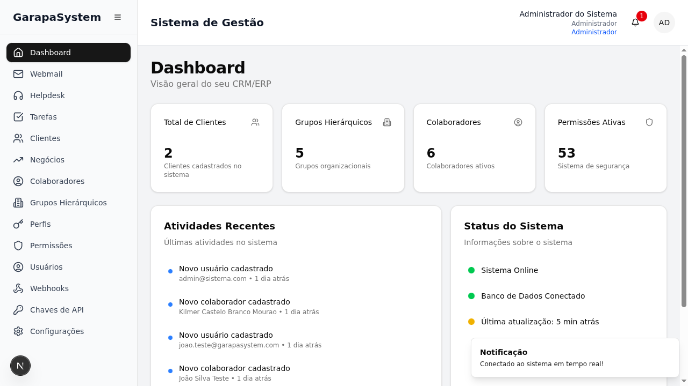


### 📋 Sistema de Tarefas
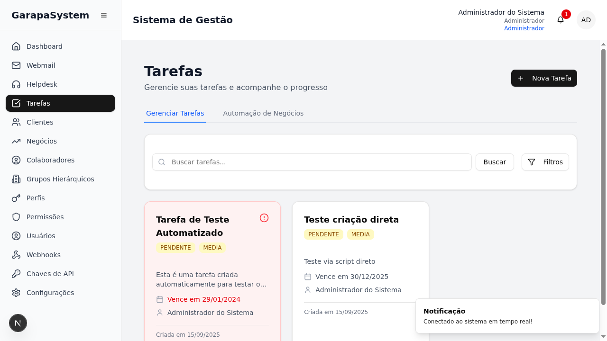

### 🎫 Helpdesk
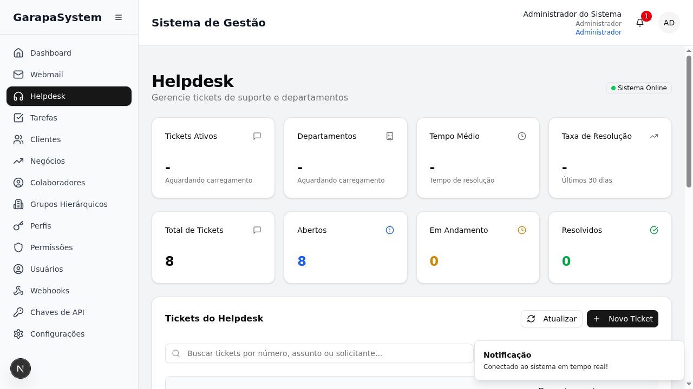

### 👥 Gestão de Clientes
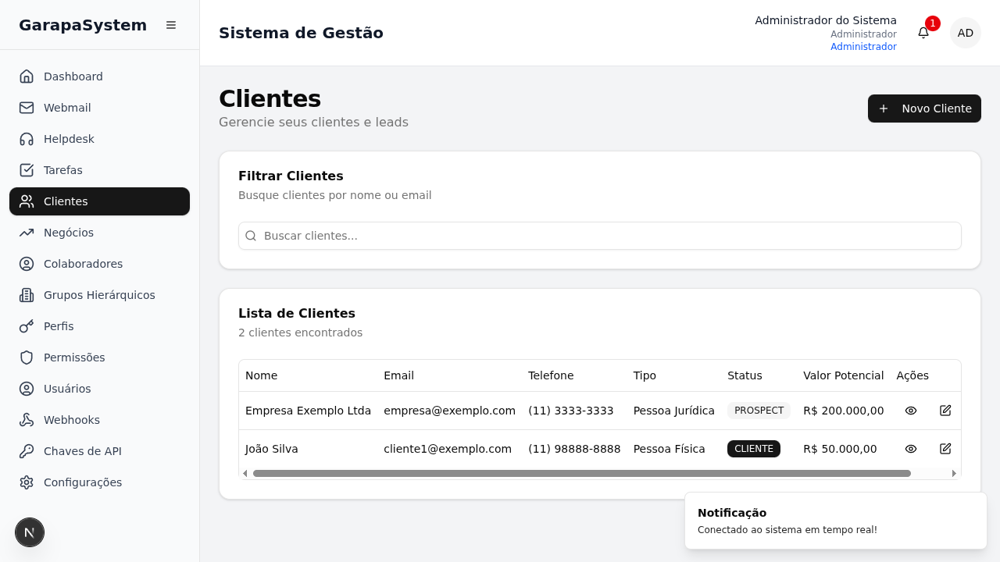
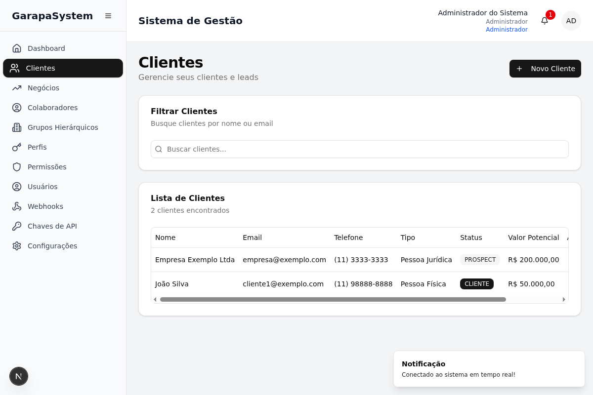

### 📧 Webmail
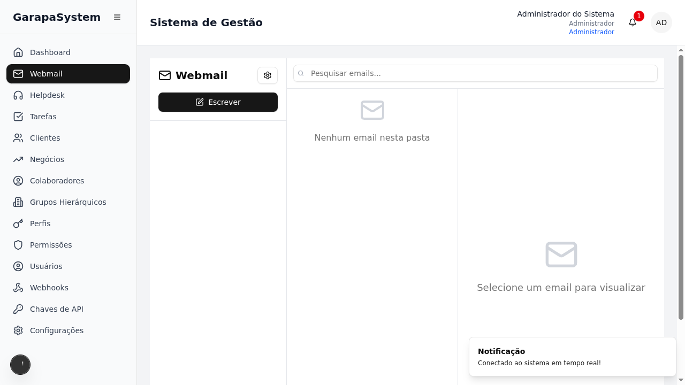
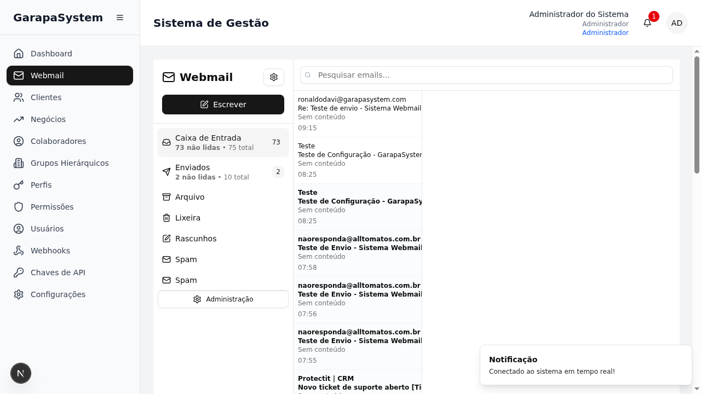
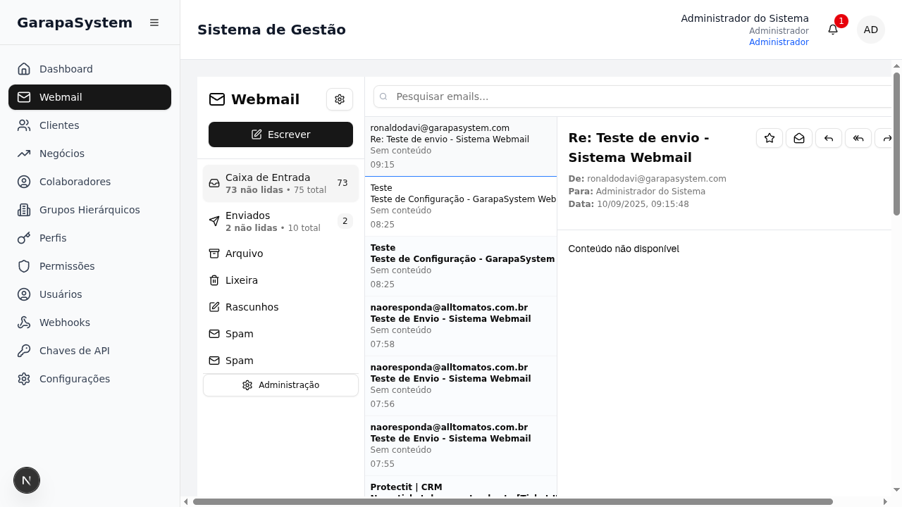

### 🔐 Autenticação
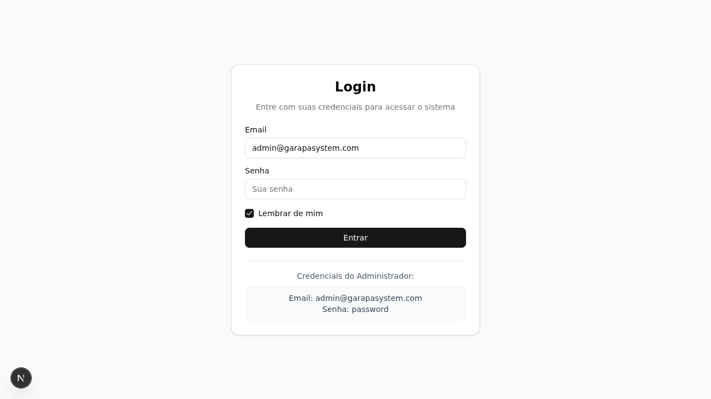

### ⚙️ Configurações e API
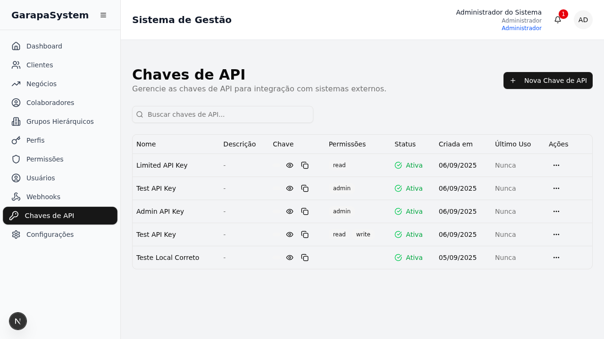
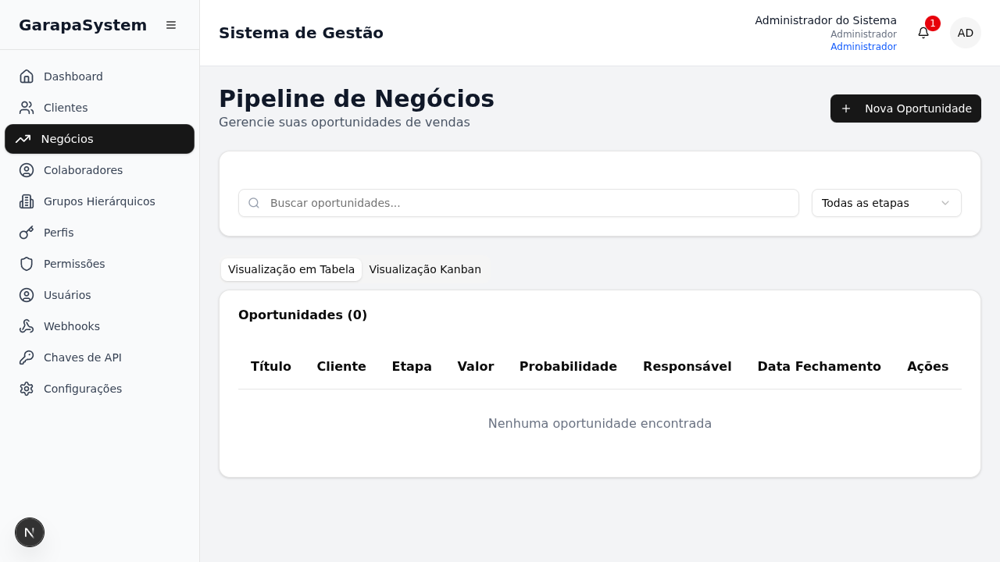

## 🔒 Segurança

- Autenticação baseada em sessões
- Middleware de segurança para APIs
- Validação de permissões granulares
- Rate limiting
- Sanitização de dados

## 📝 API Documentation

A documentação completa da API está disponível em `/swagger` quando o servidor estiver em execução.

## 🤝 Contribuição

1. Faça um fork do projeto
2. Crie uma branch para sua feature (`git checkout -b feature/AmazingFeature`)
3. Commit suas mudanças (`git commit -m 'Add some AmazingFeature'`)
4. Push para a branch (`git push origin feature/AmazingFeature`)
5. Abra um Pull Request

## 📄 Licença

Este projeto é privado e proprietário.

## 📞 Suporte

Para suporte técnico, consulte a documentação interna ou entre em contato com a equipe de desenvolvimento.

---

**GarapaSystem** - Sistema integrado de gestão empresarial