# Diagramas de Fluxo - API GarapaSystem

## Índice

1. [Fluxo de Autenticação](#fluxo-de-autenticação)
2. [Fluxo de Autorização](#fluxo-de-autorização)
3. [Fluxo de Rate Limiting](#fluxo-de-rate-limiting)
4. [Fluxo de Criação de Recursos](#fluxo-de-criação-de-recursos)
5. [Fluxo de Webhooks](#fluxo-de-webhooks)
6. [Fluxo de Tratamento de Erros](#fluxo-de-tratamento-de-erros)

---

## Fluxo de Autenticação

### Autenticação por Sessão (NextAuth)

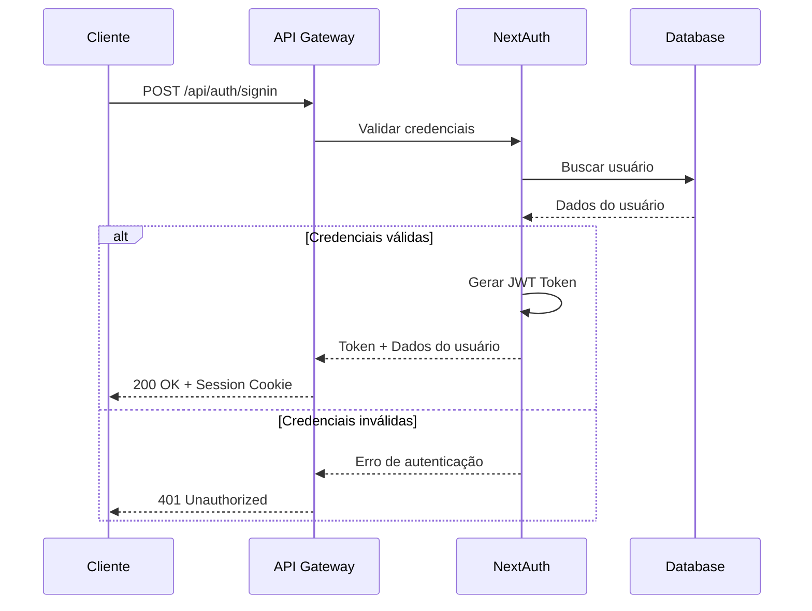

### Autenticação por API Key

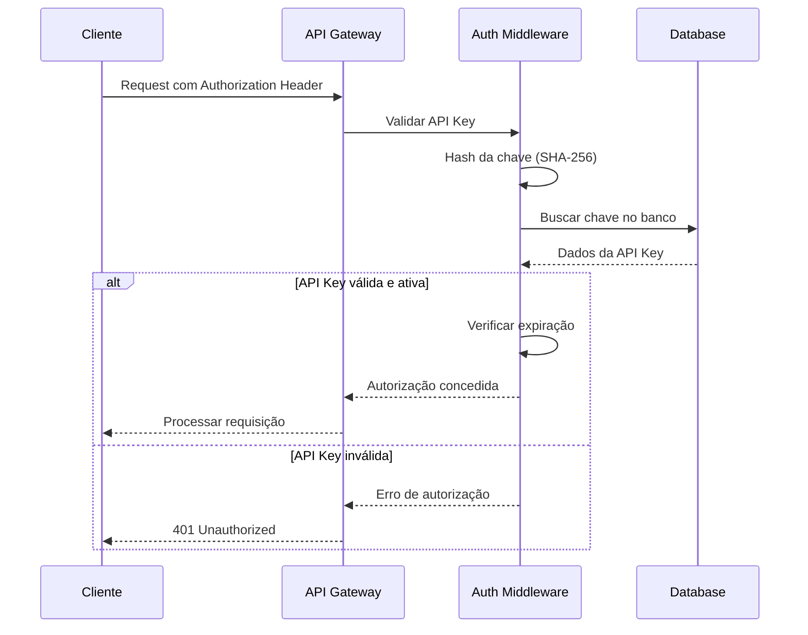

---

## Fluxo de Autorização

### Verificação de Permissões

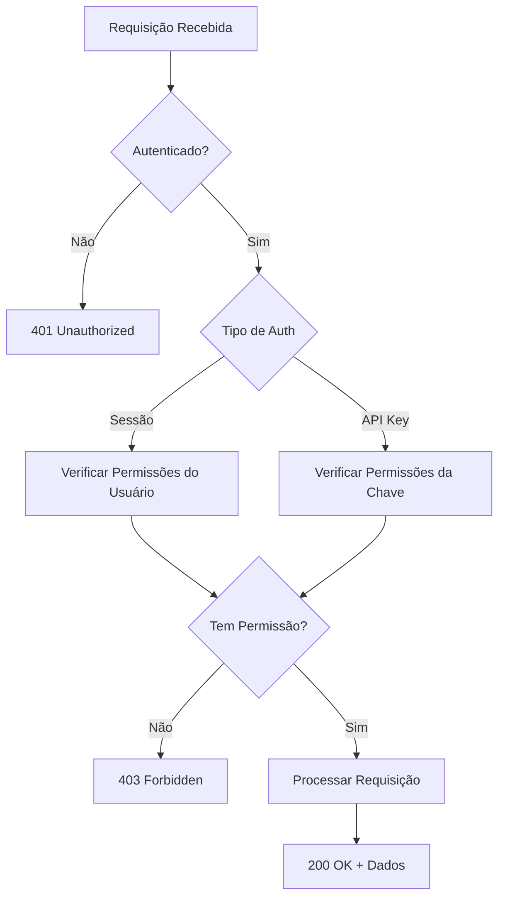

### Matriz de Permissões

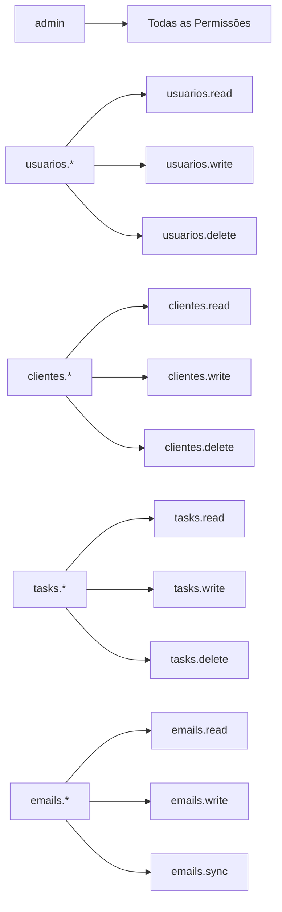

---

## Fluxo de Rate Limiting

### Controle de Requisições

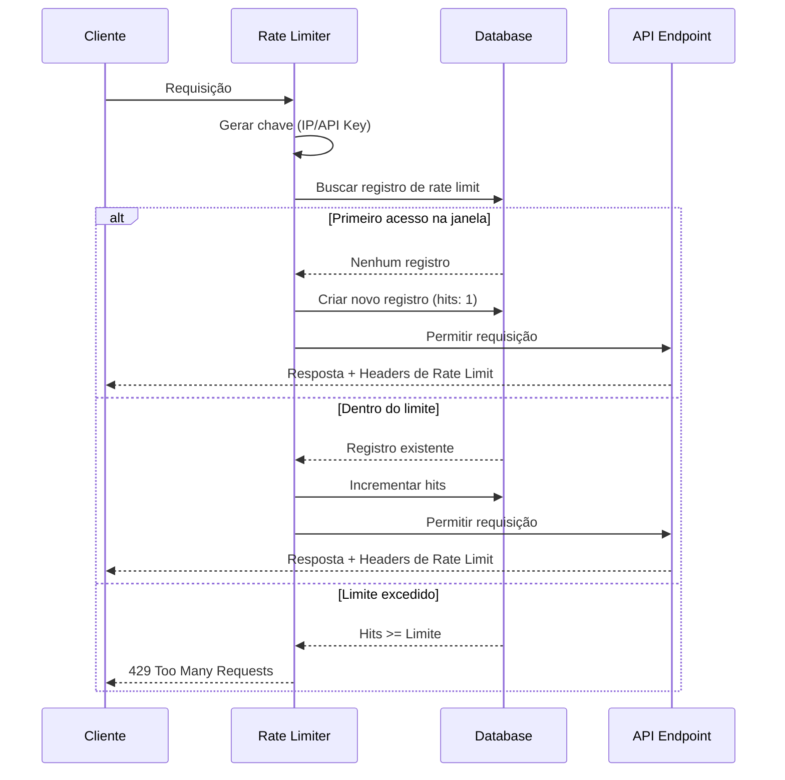

### Janela Deslizante

```mermaid
gantt
    title Rate Limiting - Janela de 60 segundos
    dateFormat X
    axisFormat %S
    
    section Requisições
    Janela 1 (100 req) :0, 60
    Janela 2 (100 req) :60, 120
    Janela 3 (100 req) :120, 180
    
    section Reset
    Reset 1 :milestone, 60, 0
    Reset 2 :milestone, 120, 0
    Reset 3 :milestone, 180, 0
```

---

## Fluxo de Criação de Recursos

### Exemplo: Criar Cliente

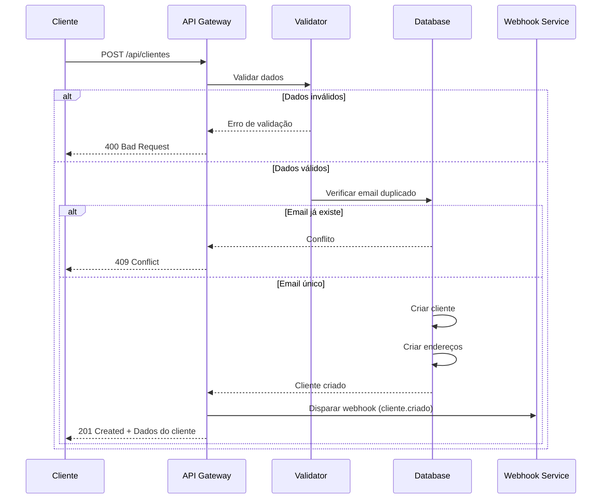

### Validação de Dados

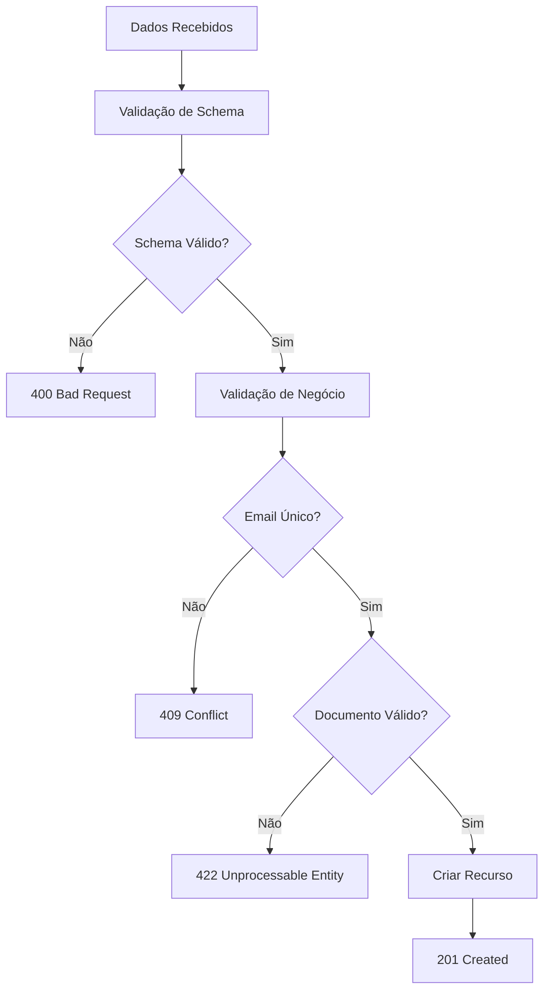

---

## Fluxo de Webhooks

### Configuração e Disparo

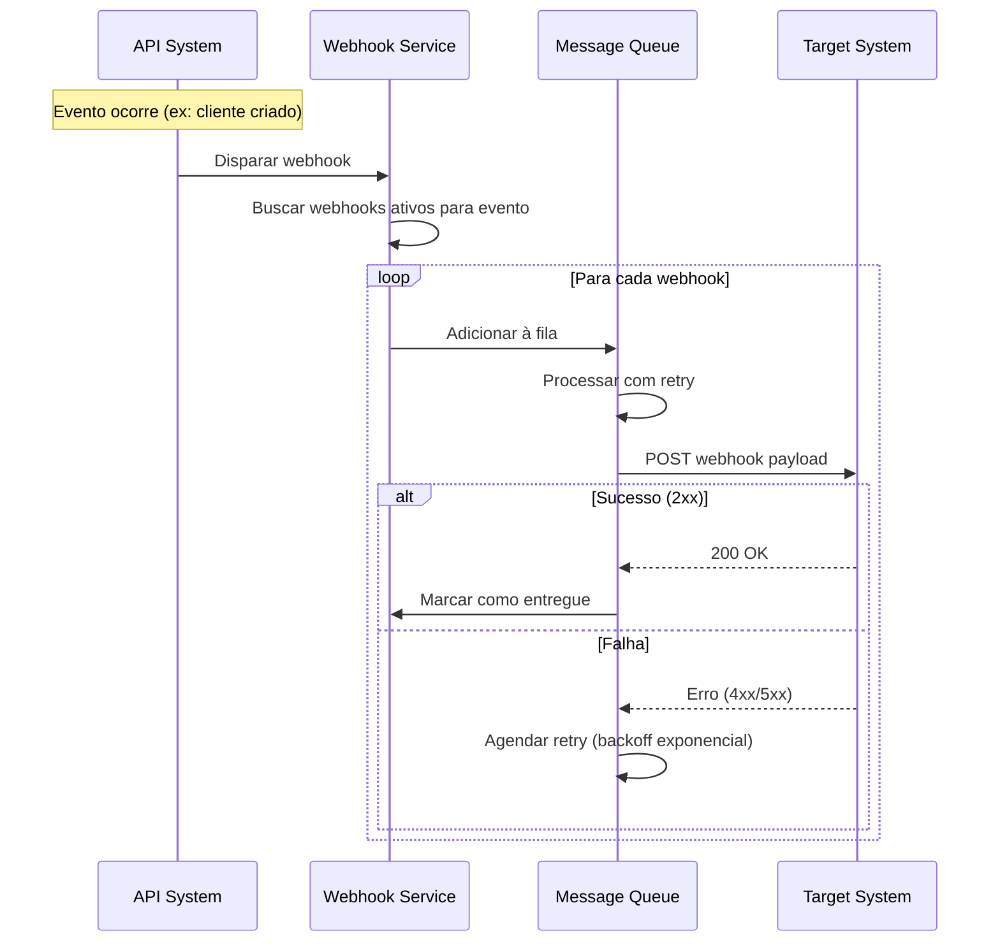

### Estrutura do Payload

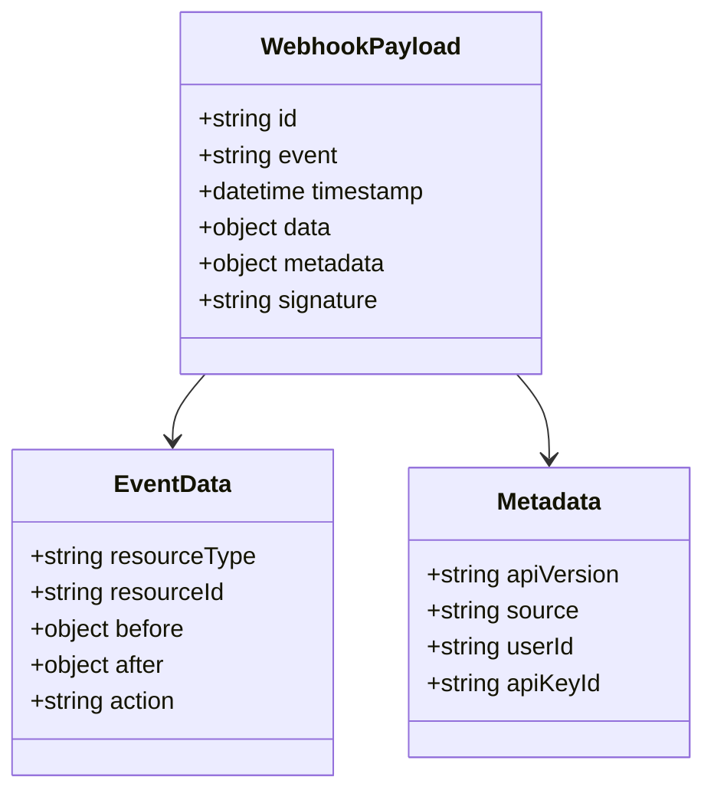

---

## Fluxo de Tratamento de Erros

### Hierarquia de Erros

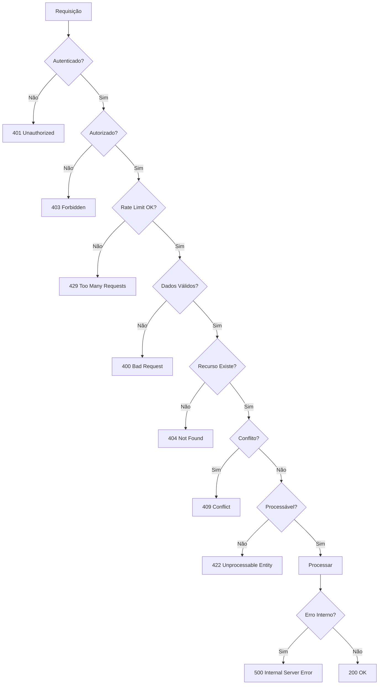

### Estrutura de Resposta de Erro

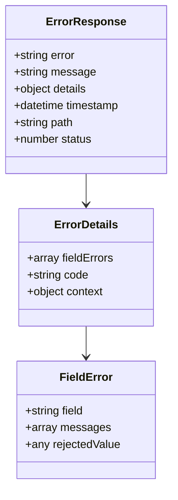

---

## Fluxo de Sincronização de E-mails

### Processo de Sincronização

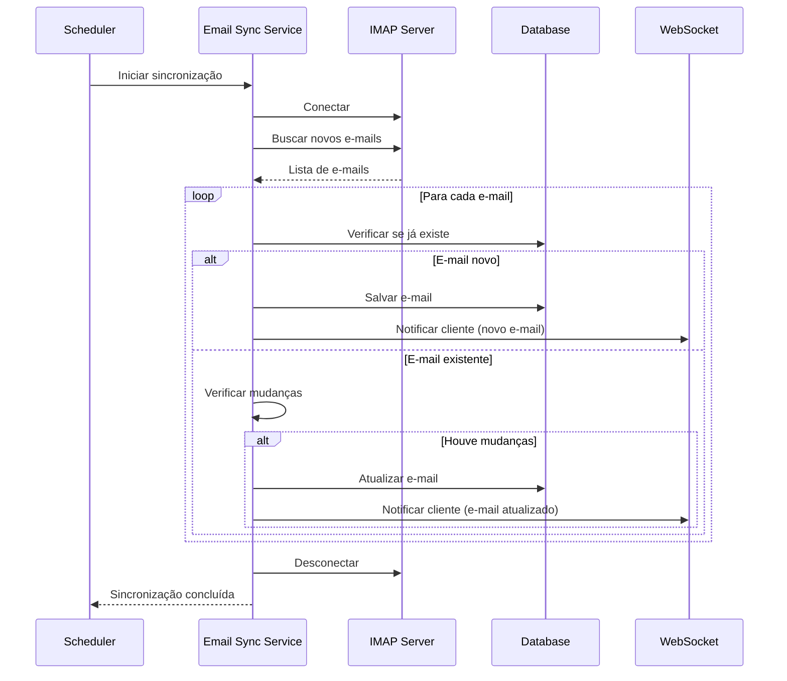

---

## Fluxo de Integração WhatsApp

### Conexão e Envio de Mensagens

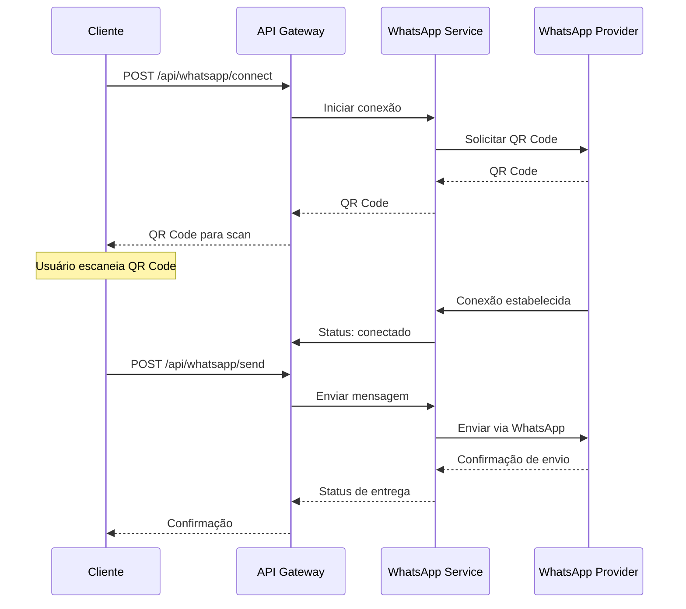

---

*Diagramas atualizados em: Janeiro 2024*
*Versão da API: 0.2.37.13*