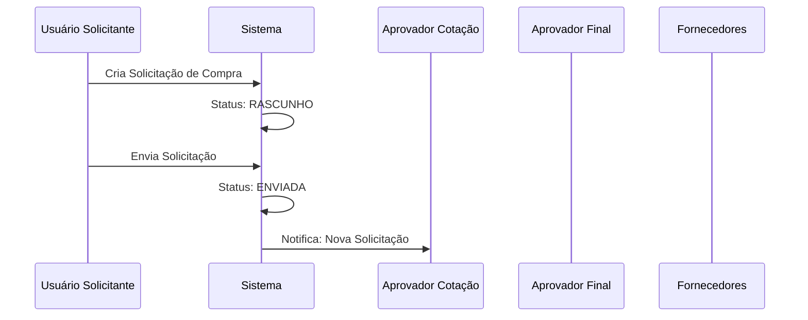
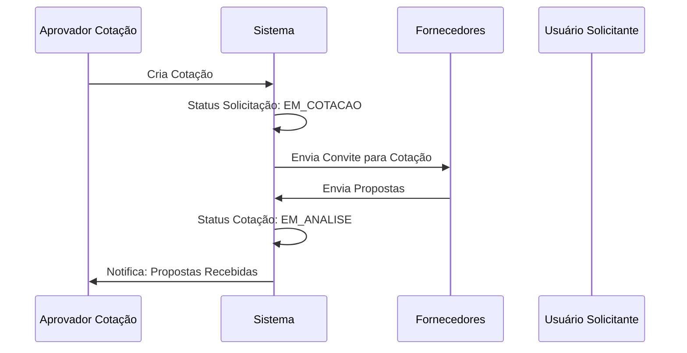
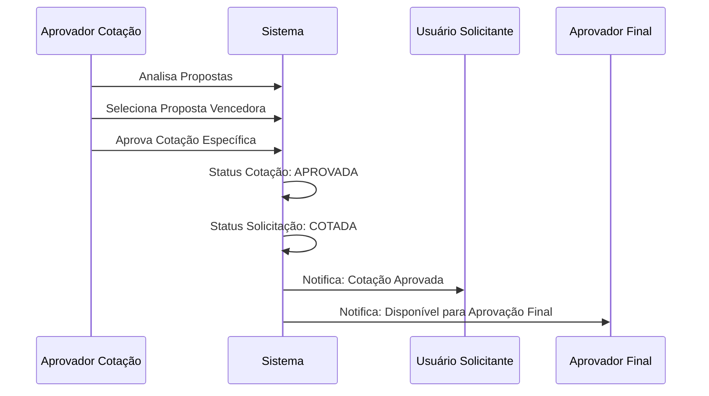
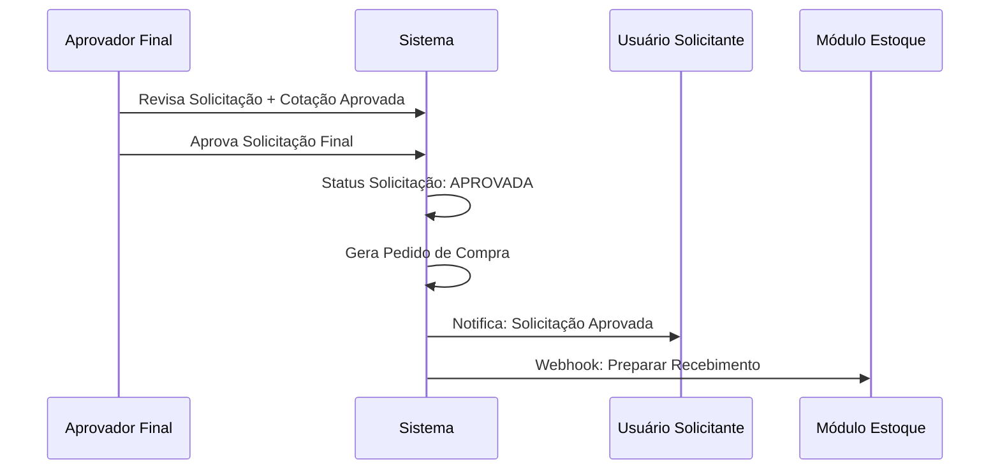
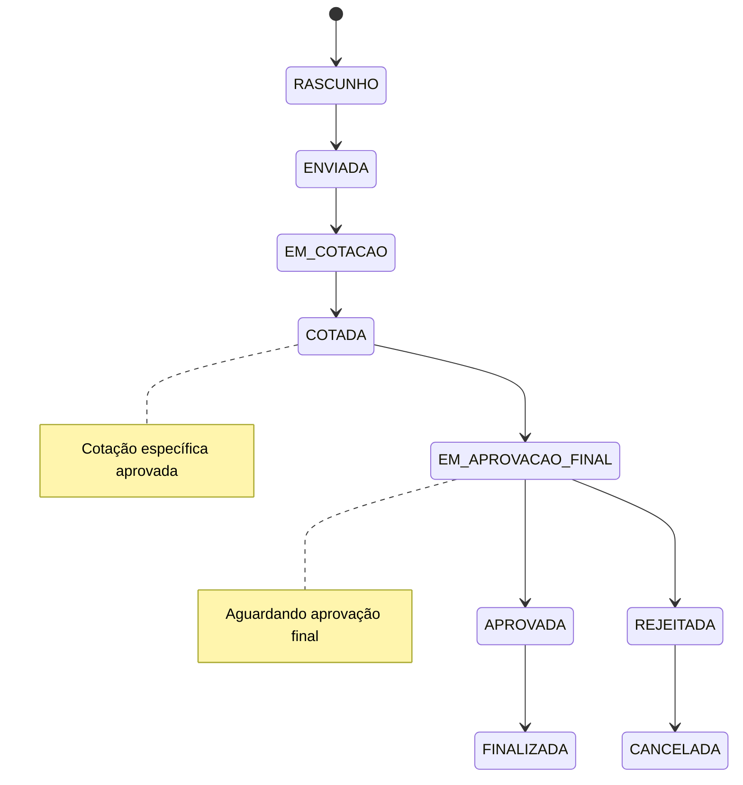
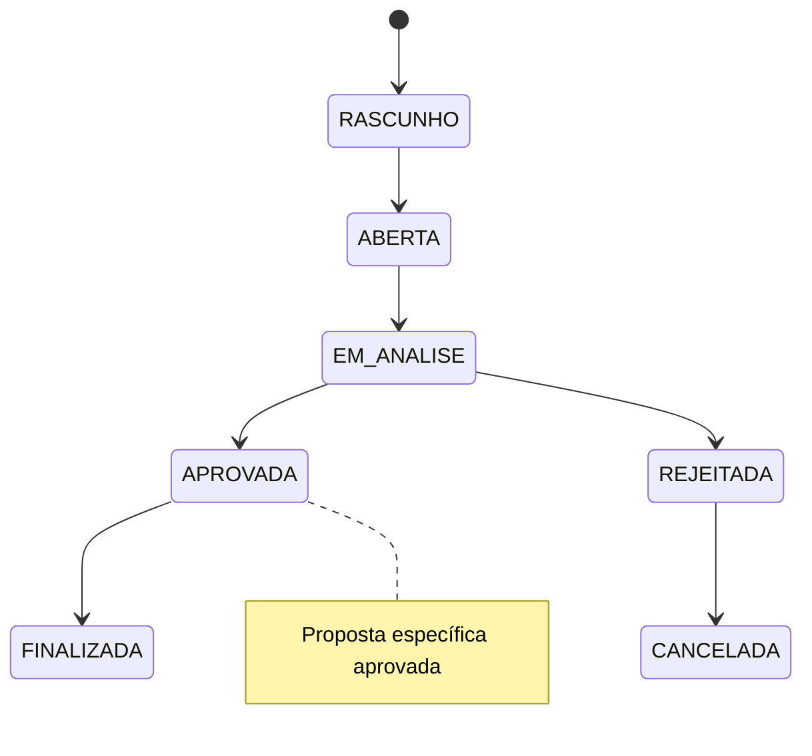

# Fluxo de Aprovação em Duas Etapas - Módulo de Compras

## 1. Visão Geral do Fluxo

O processo de aprovação em duas etapas garante que:
1. **Primeira Etapa**: Uma cotação específica seja analisada e aprovada entre as opções disponíveis
2. **Segunda Etapa**: A solicitação de compra com a cotação aprovada seja aprovada para execução

## 2. Fluxo Detalhado Passo a Passo

### 2.1 Fase 1: Criação da Solicitação



### 2.2 Fase 2: Processo de Cotação



### 2.3 Fase 3: Primeira Aprovação (Cotação)



### 2.4 Fase 4: Segunda Aprovação (Final)



## 3. Estados e Transições

### 3.1 Estados da Solicitação



### 3.2 Estados da Cotação



## 4. Regras de Negócio Detalhadas

### 4.1 Primeira Etapa: Aprovação de Cotação

#### 4.1.1 Condições para Aprovação
- ✅ Pelo menos uma proposta deve estar cadastrada
- ✅ Proposta deve atender aos requisitos técnicos
- ✅ Fornecedor deve estar ativo e qualificado
- ✅ Valor deve estar dentro do orçamento aprovado
- ✅ Prazo de entrega deve ser aceitável

#### 4.1.2 Critérios de Avaliação
```typescript
interface CriteriosAvaliacao {
  preco: number;           // Peso: 40% (0-10)
  prazo: number;           // Peso: 30% (0-10)
  qualidadeFornecedor: number; // Peso: 20% (0-10)
  condicoesPagamento: number;  // Peso: 10% (0-10)
}

// Cálculo da pontuação final
pontuacaoFinal = (preco * 0.4) + (prazo * 0.3) + (qualidade * 0.2) + (pagamento * 0.1)
```

#### 4.1.3 Aprovação Automática vs Manual
```typescript
interface RegrasAprovacaoAutomatica {
  valorMaximo: 1000;        // Até R$ 1.000 - aprovação automática
  fornecedorPreferencial: boolean; // Fornecedor com contrato ativo
  itemRecorrente: boolean;  // Item já comprado anteriormente
  margemSeguranca: 0.05;    // 5% de margem sobre menor preço
}
```

### 4.2 Segunda Etapa: Aprovação Final

#### 4.2.1 Condições para Aprovação Final
- ✅ Cotação específica deve estar aprovada
- ✅ Orçamento deve estar disponível
- ✅ Centro de custo deve estar ativo
- ✅ Aprovador deve ter nível adequado
- ✅ Não deve haver conflitos de interesse

#### 4.2.2 Níveis de Aprovação Final
```typescript
interface NiveisAprovacaoFinal {
  nivel1: { valor: 5000, cargo: "Supervisor" };
  nivel2: { valor: 25000, cargo: "Gerente" };
  nivel3: { valor: 100000, cargo: "Diretor" };
  nivel4: { valor: Infinity, cargo: "CEO" };
}
```

## 5. Cenários de Uso

### 5.1 Cenário 1: Aprovação Normal
```
1. Solicitante cria solicitação de R$ 5.000
2. Aprovador de cotação abre processo de cotação
3. 3 fornecedores enviam propostas
4. Aprovador analisa e aprova proposta com melhor custo-benefício
5. Supervisor aprova solicitação final
6. Sistema gera pedido de compra
```

### 5.2 Cenário 2: Rejeição na Primeira Etapa
```
1. Solicitante cria solicitação de R$ 15.000
2. Aprovador de cotação abre processo de cotação
3. 2 fornecedores enviam propostas
4. Aprovador rejeita ambas (preços acima do orçamento)
5. Sistema solicita nova cotação ou revisão da solicitação
6. Processo reinicia na fase de cotação
```

### 5.3 Cenário 3: Rejeição na Segunda Etapa
```
1. Cotação aprovada para R$ 45.000
2. Diretor analisa solicitação final
3. Diretor rejeita (prioridades mudaram)
4. Sistema notifica solicitante e aprovador de cotação
5. Solicitação pode ser revista ou cancelada
```

### 5.4 Cenário 4: Delegação de Aprovação
```
1. Aprovador de cotação está ausente
2. Sistema permite delegação para substituto
3. Substituto recebe notificação e acesso
4. Processo continua normalmente
5. Histórico registra a delegação
```

## 6. Notificações e Comunicação

### 6.1 Primeira Etapa - Aprovação de Cotação

| Evento | Destinatário | Meio | Template |
|--------|--------------|------|----------|
| Nova cotação criada | Fornecedores | Email | `cotacao-criada` |
| Propostas recebidas | Aprovador Cotação | Sistema + Email | `propostas-recebidas` |
| Cotação aprovada | Solicitante | Sistema + Email | `cotacao-aprovada` |
| Cotação rejeitada | Solicitante | Sistema + Email | `cotacao-rejeitada` |

### 6.2 Segunda Etapa - Aprovação Final

| Evento | Destinatário | Meio | Template |
|--------|--------------|------|----------|
| Disponível para aprovação | Aprovador Final | Sistema + Email | `aprovacao-final-pendente` |
| Solicitação aprovada | Solicitante | Sistema + Email | `solicitacao-aprovada` |
| Solicitação rejeitada | Solicitante | Sistema + Email | `solicitacao-rejeitada` |
| Pedido gerado | Fornecedor | Email | `pedido-gerado` |

## 7. Integrações Entre Etapas

### 7.1 Dados Transferidos da Primeira para Segunda Etapa

```typescript
interface DadosTransferencia {
  cotacaoId: string;
  propostaAprovadaId: string;
  criteriosAvaliacao: CriteriosAvaliacao;
  justificativaAprovacao: string;
  valorAprovado: number;
  fornecedorSelecionado: string;
  prazoEntrega: number;
  condicoesPagamento: string;
}
```

### 7.2 Validações na Segunda Etapa

```typescript
interface ValidacoesSegundaEtapa {
  // Validar se cotação está realmente aprovada
  cotacaoAprovada: boolean;
  
  // Validar se orçamento ainda está disponível
  orcamentoDisponivel: boolean;
  
  // Validar se fornecedor ainda está ativo
  fornecedorAtivo: boolean;
  
  // Validar se preços não mudaram significativamente
  precoEstavel: boolean;
  
  // Validar se aprovador tem nível adequado
  nivelAprovadorAdequado: boolean;
}
```

## 8. Auditoria e Rastreabilidade

### 8.1 Log de Eventos

```typescript
interface LogEventoAprovacao {
  id: string;
  timestamp: DateTime;
  etapa: "PRIMEIRA" | "SEGUNDA";
  acao: "APROVADO" | "REJEITADO" | "DELEGADO";
  usuarioId: string;
  solicitacaoId: string;
  cotacaoId?: string;
  propostaId?: string;
  justificativa: string;
  dadosAntes: Json;
  dadosDepois: Json;
  ip: string;
  userAgent: string;
}
```

### 8.2 Relatórios de Auditoria

1. **Relatório de Tempo de Aprovação**
   - Tempo médio por etapa
   - Gargalos identificados
   - Comparativo por período

2. **Relatório de Decisões**
   - Taxa de aprovação por etapa
   - Principais motivos de rejeição
   - Análise de critérios utilizados

3. **Relatório de Eficiência**
   - Número de iterações por solicitação
   - Retrabalho por etapa
   - Satisfação dos usuários

## 9. Indicadores de Performance

### 9.1 KPIs da Primeira Etapa
- **Tempo médio de aprovação de cotação**: < 3 dias úteis
- **Taxa de aprovação na primeira análise**: > 80%
- **Número médio de propostas por cotação**: ≥ 3
- **Economia gerada pela análise**: > 10%

### 9.2 KPIs da Segunda Etapa
- **Tempo médio de aprovação final**: < 2 dias úteis
- **Taxa de aprovação final**: > 90%
- **Tempo total do processo**: < 7 dias úteis
- **Satisfação do solicitante**: > 4.5/5

### 9.3 KPIs Gerais do Processo
- **Redução de custos**: > 15%
- **Conformidade com orçamento**: > 95%
- **Rastreabilidade**: 100%
- **Tempo de ciclo completo**: < 10 dias úteis

## 10. Casos de Exceção

### 10.1 Urgência Extrema
- Processo acelerado com aprovação em paralelo
- Notificação imediata para todos os aprovadores
- Justificativa obrigatória para urgência

### 10.2 Fornecedor Único
- Dispensa de processo de cotação competitiva
- Justificativa técnica obrigatória
- Aprovação adicional para casos de fornecedor único

### 10.3 Valores Emergenciais
- Aprovação retroativa permitida
- Limite máximo para emergência: R$ 5.000
- Regularização obrigatória em 48h

### 10.4 Falha de Sistema
- Processo manual de backup
- Registro posterior no sistema
- Auditoria especial para casos manuais