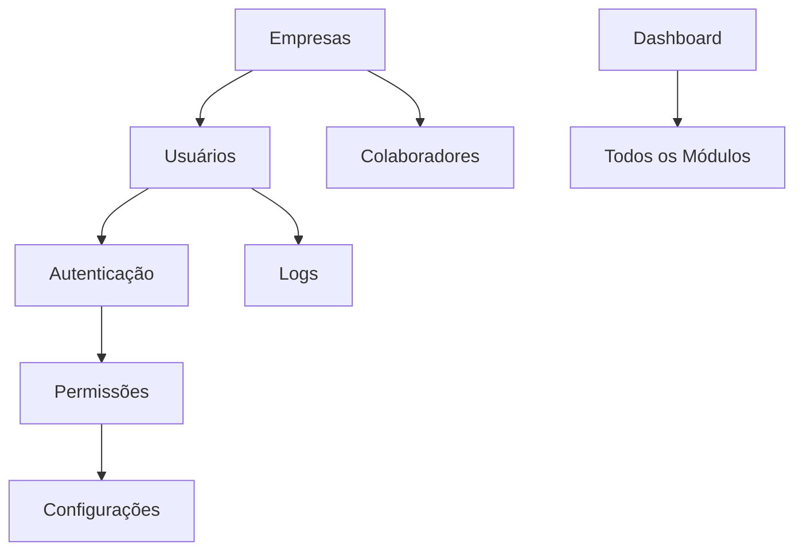
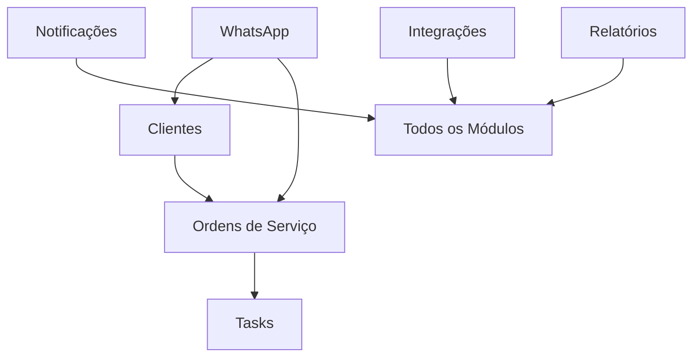
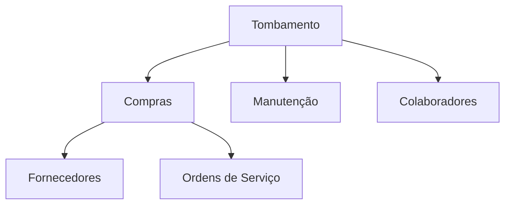

# Índice de Módulos do Sistema

**Versão:** 1.0  
**Data:** Janeiro 2025  
**Status:** Documentação Completa  

---

## 📋 Visão Geral

Este documento apresenta o índice completo de todos os módulos do sistema, organizados por categoria e status de implementação. Cada módulo possui documentação detalhada incluindo objetivos, requisitos, funcionalidades, arquitetura técnica e cronograma de implementação.

---

## 🏗️ Módulos Implementados

### Core System
| Módulo | Status | Categoria | Descrição | Documentação |
|--------|--------|-----------|-----------|--------------|
| **Dashboard** | ✅ Implementado | Analytics | Painel principal com métricas e indicadores | [dashboard.md](./modulos/dashboard.md) |
| **Usuários** | ✅ Implementado | Segurança | Gestão de usuários e perfis | [usuarios.md](./modulos/usuarios.md) |
| **Autenticação** | ✅ Implementado | Segurança | Sistema de login e autenticação | [autenticacao.md](./modulos/autenticacao.md) |
| **Permissões** | ✅ Implementado | Segurança | Controle de acesso e autorização | [permissoes.md](./modulos/permissoes.md) |
| **Configurações** | ✅ Implementado | Sistema | Configurações globais e por empresa | [configuracoes.md](./modulos/configuracoes.md) |
| **Logs** | ✅ Implementado | Sistema | Sistema de auditoria e logs | [logs.md](./modulos/logs.md) |

### Business Modules
| Módulo | Status | Categoria | Descrição | Documentação |
|--------|--------|-----------|-----------|--------------|
| **Empresas** | ✅ Implementado | Gestão | Gestão de empresas e filiais | [empresas.md](./modulos/empresas.md) |
| **Colaboradores** | ✅ Implementado | RH | Gestão de colaboradores e estrutura organizacional | [colaboradores.md](./modulos/colaboradores.md) |
| **Clientes** | ✅ Implementado | CRM | Gestão de clientes e relacionamento | [clientes.md](./modulos/clientes.md) |
| **Ordens de Serviço** | ✅ Implementado | Operacional | Gestão de ordens de serviço e atendimentos | [ordens-servico.md](./modulos/ordens-servico.md) |
| **Tasks** | ✅ Implementado | Produtividade | Sistema de tarefas e gestão de atividades | [tasks.md](./modulos/tasks.md) |

### Communication & Integration
| Módulo | Status | Categoria | Descrição | Documentação |
|--------|--------|-----------|-----------|--------------|
| **WhatsApp** | ✅ Implementado | Comunicação | Integração com WhatsApp Business | [whatsapp.md](./modulos/whatsapp.md) |
| **Notificações** | ✅ Implementado | Comunicação | Sistema de notificações multi-canal | [notificacoes.md](./modulos/notificacoes.md) |
| **Integrações** | ✅ Implementado | Integração | Conectores e APIs externas | [integracoes.md](./modulos/integracoes.md) |

### Analytics & Reports
| Módulo | Status | Categoria | Descrição | Documentação |
|--------|--------|-----------|-----------|--------------|
| **Relatórios** | ✅ Implementado | Analytics | Sistema de relatórios e dashboards | [relatorios.md](./modulos/relatorios.md) |

---

## 🚧 Módulos Planejados

### Procurement & Assets
| Módulo | Status | Categoria | Descrição | Documentação |
|--------|--------|-----------|-----------|--------------|
| **Compras** | 📋 Planejado | Procurement | Sistema de compras e fornecedores | [compras.md](./modulos/compras.md) |
| **Tombamento** | 📋 Planejado | Asset Management | Gestão de patrimônio e ativos | [tombamento.md](./modulos/tombamento.md) |

---

## 📊 Estatísticas de Implementação

### Por Status
- ✅ **Implementados:** 15 módulos (88.2%)
- 📋 **Planejados:** 2 módulos (11.8%)
- **Total:** 17 módulos

### Por Categoria
- **Segurança:** 3 módulos (17.6%)
- **Sistema:** 2 módulos (11.8%)
- **Gestão:** 2 módulos (11.8%)
- **Comunicação:** 2 módulos (11.8%)
- **Analytics:** 2 módulos (11.8%)
- **CRM:** 1 módulo (5.9%)
- **RH:** 1 módulo (5.9%)
- **Operacional:** 1 módulo (5.9%)
- **Produtividade:** 1 módulo (5.9%)
- **Integração:** 1 módulo (5.9%)
- **Procurement:** 1 módulo (5.9%)
- **Asset Management:** 1 módulo (5.9%)

---

## 🔗 Dependências Entre Módulos

### Módulos Core (Dependências Base)

### Módulos de Negócio

### Módulos Planejados

---

## 📋 Padrões de Documentação

### Estrutura Padrão
Cada módulo segue a seguinte estrutura de documentação:

1. **Visão Geral**
   - Propósito e contexto
   - Status de implementação

2. **Objetivos e Requisitos**
   - Objetivos principais
   - Requisitos funcionais
   - Requisitos não-funcionais

3. **Funcionalidades**
   - Funcionalidades principais
   - Casos de uso
   - Fluxos de trabalho

4. **Arquitetura Técnica**
   - Estrutura de arquivos
   - Modelos de dados (Prisma)
   - Hooks customizados

5. **APIs e Endpoints**
   - Endpoints REST
   - Parâmetros e respostas
   - Autenticação

6. **Componentes de Interface**
   - Páginas principais
   - Componentes reutilizáveis
   - Estados de interface

7. **Permissões e Segurança**
   - Permissões necessárias
   - Níveis de acesso
   - Medidas de segurança

8. **Integrações**
   - Módulos internos
   - Sistemas externos
   - Tecnologias utilizadas

9. **Cronograma de Implementação**
   - Fases de desenvolvimento
   - Marcos importantes
   - Melhorias futuras

10. **Testes e Validação**
    - Estratégia de testes
    - Critérios de aceitação
    - Métricas de qualidade

---

## 🛠️ Tecnologias Utilizadas

### Frontend
- **Framework:** Next.js 14 (App Router)
- **UI Library:** React 18
- **Styling:** Tailwind CSS + shadcn/ui
- **State Management:** Zustand
- **Forms:** React Hook Form + Zod
- **Charts:** Recharts
- **Icons:** Lucide React

### Backend
- **Runtime:** Node.js
- **Database:** PostgreSQL
- **ORM:** Prisma
- **Authentication:** NextAuth.js
- **API:** REST + tRPC
- **File Storage:** AWS S3 / Local

### DevOps & Tools
- **Version Control:** Git
- **CI/CD:** GitHub Actions
- **Testing:** Jest + Playwright
- **Monitoring:** Sentry
- **Documentation:** Markdown

---

## 📈 Roadmap de Desenvolvimento

### Q1 2025 - Consolidação
- ✅ Finalizar documentação de todos os módulos
- 🔄 Implementar melhorias nos módulos existentes
- 🔄 Otimizar performance e UX

### Q2 2025 - Expansão
- 📋 Implementar módulo de Compras
- 📋 Desenvolver integrações avançadas
- 📋 Melhorar sistema de relatórios

### Q3 2025 - Inovação
- 📋 Implementar módulo de Tombamento
- 📋 Adicionar recursos de IA/ML
- 📋 Desenvolver app mobile

### Q4 2025 - Otimização
- 📋 Implementar recursos avançados
- 📋 Otimizar escalabilidade
- 📋 Preparar para próxima versão

---

## 📞 Contato e Suporte

### Equipe de Desenvolvimento
- **Tech Lead:** Responsável pela arquitetura geral
- **Frontend Team:** Desenvolvimento de interfaces
- **Backend Team:** APIs e integrações
- **QA Team:** Testes e qualidade
- **DevOps Team:** Infraestrutura e deploy

### Documentação
- **Localização:** `/app/docs/`
- **Formato:** Markdown
- **Versionamento:** Git
- **Atualizações:** Mensais

---

**Última atualização:** Janeiro 2025  
**Próxima revisão:** Fevereiro 2025  
**Mantido por:** Equipe de Desenvolvimento