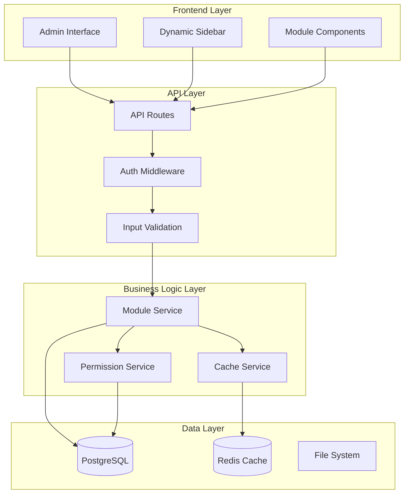
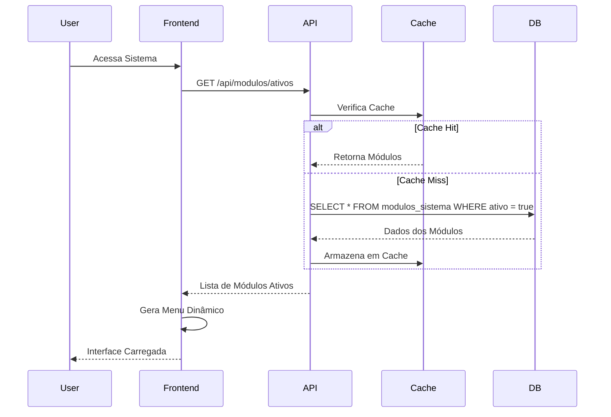
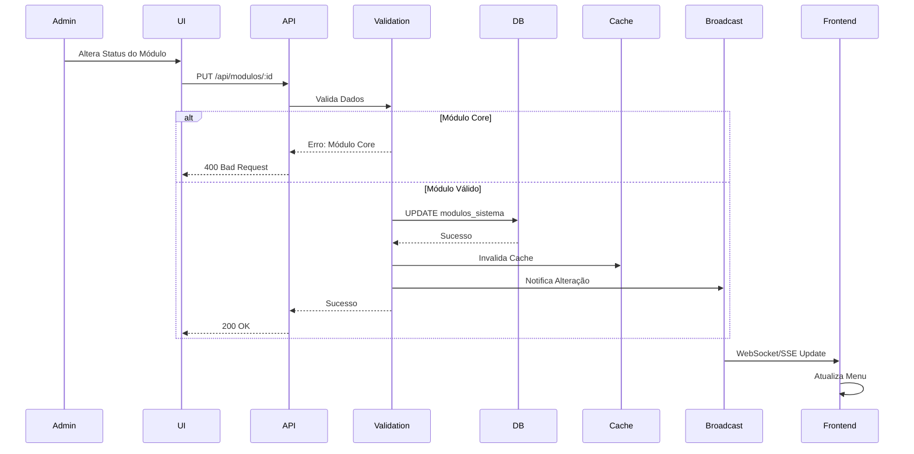
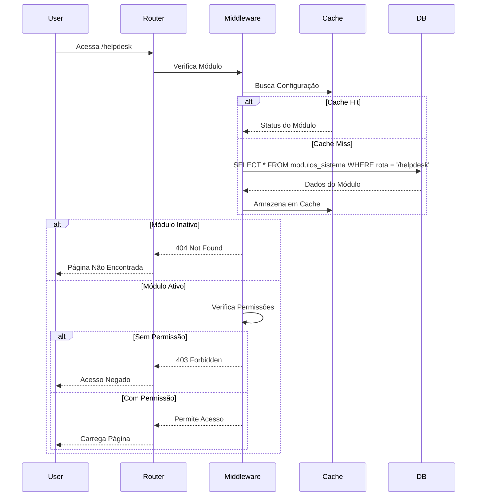

# Arquitetura Técnica - Sistema de Gerenciamento de Módulos

## Diagrama de Arquitetura Geral



## Fluxo de Dados Detalhado

### 1. Carregamento Inicial do Sistema



### 2. Alteração de Configuração de Módulo



### 3. Verificação de Acesso a Rota



## Estrutura de Arquivos

```
src/
├── app/
│   ├── api/
│   │   └── modulos/
│   │       ├── route.ts                 # CRUD básico
│   │       ├── ativos/
│   │       │   └── route.ts            # Módulos ativos
│   │       ├── [id]/
│   │       │   └── route.ts            # Operações específicas
│   │       └── bulk-update/
│   │           └── route.ts            # Atualização em lote
│   └── configuracoes/
│       └── modulos/
│           ├── page.tsx                # Página principal
│           ├── loading.tsx             # Loading state
│           └── components/
│               ├── ModuleCard.tsx      # Card do módulo
│               ├── ModuleToggle.tsx    # Switch ativo/inativo
│               ├── ModuleFilters.tsx   # Filtros e busca
│               └── ModuleBulkActions.tsx # Ações em lote
├── components/
│   ├── layout/
│   │   └── Sidebar.tsx                 # Sidebar dinâmica
│   └── modulos/
│       ├── ModuleProvider.tsx          # Context Provider
│       ├── ModuleGuard.tsx             # Proteção de rotas
│       └── ModuleStatusBadge.tsx       # Badge de status
├── lib/
│   ├── services/
│   │   ├── moduleService.ts            # Lógica de negócio
│   │   ├── cacheService.ts             # Gerenciamento de cache
│   │   └── permissionService.ts        # Verificação de permissões
│   ├── hooks/
│   │   ├── useModulos.ts               # Hook para módulos
│   │   ├── useModuleAccess.ts          # Hook para verificar acesso
│   │   └── useModuleConfig.ts          # Hook para configurações
│   ├── types/
│   │   └── module.ts                   # Tipos TypeScript
│   └── utils/
│       ├── moduleUtils.ts              # Utilitários
│       └── moduleValidation.ts         # Validações
├── middleware.ts                       # Middleware Next.js
└── prisma/
    ├── schema.prisma                   # Schema do banco
    ├── migrations/                     # Migrações
    └── seeds/
        └── modules.ts                  # Seed dos módulos
```

## Padrões de Design Utilizados

### 1. Repository Pattern

```typescript
// moduleRepository.ts
export class ModuleRepository {
  async findAll(): Promise<ModuloSistema[]> {
    return await prisma.moduloSistema.findMany();
  }
  
  async findActive(): Promise<ModuloSistema[]> {
    return await prisma.moduloSistema.findMany({
      where: { ativo: true }
    });
  }
  
  async updateStatus(id: string, ativo: boolean): Promise<ModuloSistema> {
    return await prisma.moduloSistema.update({
      where: { id },
      data: { ativo }
    });
  }
}
```

### 2. Service Layer Pattern

```typescript
// moduleService.ts
export class ModuleService {
  constructor(
    private repository: ModuleRepository,
    private cache: CacheService,
    private permissions: PermissionService
  ) {}
  
  async toggleModule(id: string, ativo: boolean, userId: string): Promise<void> {
    // Validações de negócio
    const module = await this.repository.findById(id);
    if (module.core && !ativo) {
      throw new Error('Módulos core não podem ser desativados');
    }
    
    // Verifica permissões
    await this.permissions.requireAdmin(userId);
    
    // Atualiza módulo
    await this.repository.updateStatus(id, ativo);
    
    // Invalida cache
    await this.cache.invalidate('modules:active');
  }
}
```

### 3. Factory Pattern

```typescript
// moduleFactory.ts
export class ModuleFactory {
  static createDefaultModules(): Partial<ModuloSistema>[] {
    return [
      {
        nome: 'dashboard',
        titulo: 'Dashboard',
        core: true,
        ativo: true,
        icone: 'LayoutDashboard',
        ordem: 1
      },
      // ... outros módulos
    ];
  }
}
```

### 4. Observer Pattern

```typescript
// moduleEventEmitter.ts
export class ModuleEventEmitter extends EventEmitter {
  onModuleToggled(callback: (moduleId: string, active: boolean) => void) {
    this.on('module:toggled', callback);
  }
  
  emitModuleToggled(moduleId: string, active: boolean) {
    this.emit('module:toggled', moduleId, active);
  }
}
```

## Estratégias de Cache

### 1. Cache de Módulos Ativos

```typescript
// Chave: "modules:active"
// TTL: 1 hora
// Invalidação: Quando qualquer módulo é alterado

const getActiveModules = async (): Promise<ModuloSistema[]> => {
  const cached = await redis.get('modules:active');
  if (cached) {
    return JSON.parse(cached);
  }
  
  const modules = await moduleRepository.findActive();
  await redis.setex('modules:active', 3600, JSON.stringify(modules));
  return modules;
};
```

### 2. Cache de Configurações por Usuário

```typescript
// Chave: "user:modules:{userId}"
// TTL: 30 minutos
// Invalidação: Quando módulos ou permissões do usuário mudam

const getUserModules = async (userId: string): Promise<ModuloSistema[]> => {
  const cacheKey = `user:modules:${userId}`;
  const cached = await redis.get(cacheKey);
  
  if (cached) {
    return JSON.parse(cached);
  }
  
  const userPermissions = await getUserPermissions(userId);
  const activeModules = await getActiveModules();
  const userModules = activeModules.filter(module => 
    !module.permissao || userPermissions.includes(module.permissao)
  );
  
  await redis.setex(cacheKey, 1800, JSON.stringify(userModules));
  return userModules;
};
```

## Tratamento de Erros

### 1. Hierarquia de Erros

```typescript
// errors/ModuleError.ts
export class ModuleError extends Error {
  constructor(message: string, public code: string) {
    super(message);
    this.name = 'ModuleError';
  }
}

export class CoreModuleError extends ModuleError {
  constructor() {
    super('Módulos core não podem ser desativados', 'CORE_MODULE_IMMUTABLE');
  }
}

export class ModuleNotFoundError extends ModuleError {
  constructor(moduleId: string) {
    super(`Módulo ${moduleId} não encontrado`, 'MODULE_NOT_FOUND');
  }
}
```

### 2. Error Boundary

```typescript
// components/ModuleErrorBoundary.tsx
export class ModuleErrorBoundary extends Component {
  state = { hasError: false, error: null };
  
  static getDerivedStateFromError(error: Error) {
    return { hasError: true, error };
  }
  
  componentDidCatch(error: Error, errorInfo: ErrorInfo) {
    console.error('Module Error:', error, errorInfo);
    // Enviar para serviço de monitoramento
  }
  
  render() {
    if (this.state.hasError) {
      return <ModuleErrorFallback error={this.state.error} />;
    }
    
    return this.props.children;
  }
}
```

## Testes

### 1. Testes Unitários

```typescript
// __tests__/moduleService.test.ts
describe('ModuleService', () => {
  it('should not allow disabling core modules', async () => {
    const service = new ModuleService(mockRepository, mockCache, mockPermissions);
    
    await expect(
      service.toggleModule('core-module-id', false, 'admin-id')
    ).rejects.toThrow(CoreModuleError);
  });
  
  it('should invalidate cache when module is toggled', async () => {
    const service = new ModuleService(mockRepository, mockCache, mockPermissions);
    
    await service.toggleModule('optional-module-id', false, 'admin-id');
    
    expect(mockCache.invalidate).toHaveBeenCalledWith('modules:active');
  });
});
```

### 2. Testes de Integração

```typescript
// __tests__/integration/moduleAPI.test.ts
describe('Module API', () => {
  it('should return active modules', async () => {
    const response = await request(app)
      .get('/api/modulos/ativos')
      .expect(200);
    
    expect(response.body).toEqual(
      expect.arrayContaining([
        expect.objectContaining({
          nome: expect.any(String),
          ativo: true
        })
      ])
    );
  });
});
```

## Monitoramento e Observabilidade

### 1. Métricas

```typescript
// metrics/moduleMetrics.ts
export const moduleMetrics = {
  moduleToggleCount: new Counter({
    name: 'module_toggle_total',
    help: 'Total number of module toggles',
    labelNames: ['module_name', 'action']
  }),
  
  moduleAccessCount: new Counter({
    name: 'module_access_total',
    help: 'Total number of module accesses',
    labelNames: ['module_name', 'user_id']
  }),
  
  cacheHitRate: new Histogram({
    name: 'module_cache_hit_rate',
    help: 'Module cache hit rate'
  })
};
```

### 2. Logs Estruturados

```typescript
// logging/moduleLogger.ts
export const moduleLogger = {
  moduleToggled: (moduleId: string, active: boolean, userId: string) => {
    logger.info('Module toggled', {
      event: 'module_toggled',
      moduleId,
      active,
      userId,
      timestamp: new Date().toISOString()
    });
  },
  
  moduleAccessed: (moduleId: string, userId: string) => {
    logger.info('Module accessed', {
      event: 'module_accessed',
      moduleId,
      userId,
      timestamp: new Date().toISOString()
    });
  }
};
```

Esta arquitetura garante escalabilidade, manutenibilidade e performance do sistema de gerenciamento de módulos, seguindo as melhores práticas de desenvolvimento de software.