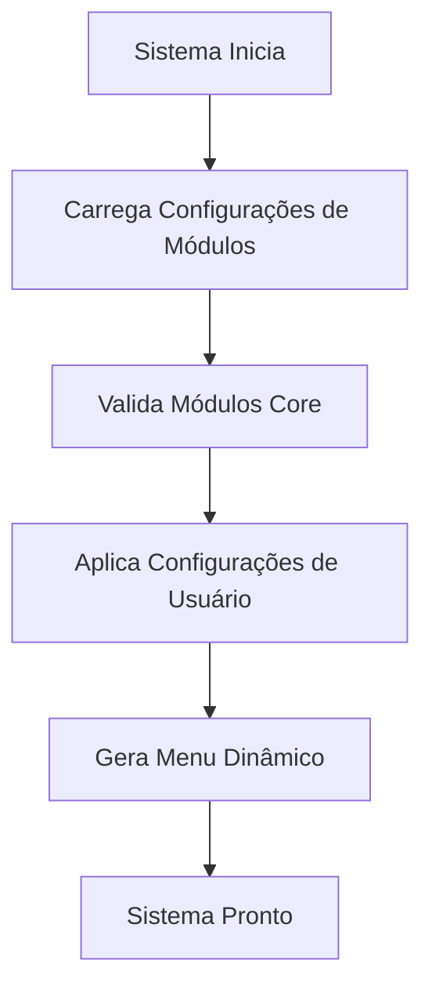
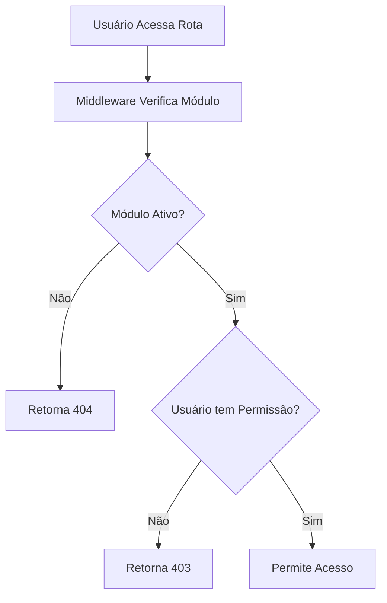
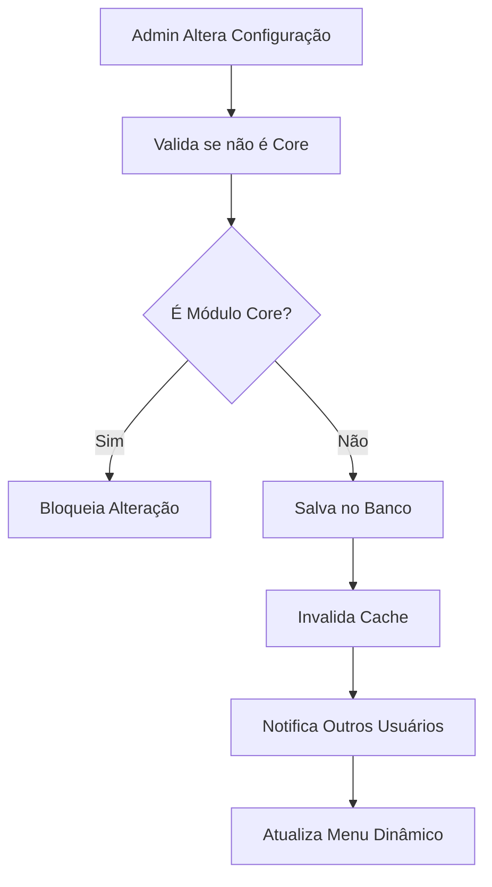

# Sistema de Gerenciamento de Módulos - GarapaSystem

## Visão Geral

O Sistema de Gerenciamento de Módulos é o componente central responsável por coordenar, ativar e desativar funcionalidades do GarapaSystem. Este módulo permite que administradores controlem quais funcionalidades estão disponíveis para os usuários, proporcionando flexibilidade e personalização da experiência do sistema.

## Arquitetura

### Componentes Principais

```
┌─────────────────────────────────────────────────────────────┐
│                    Module Manager Core                      │
├─────────────────────────────────────────────────────────────┤
│  ┌─────────────────┐  ┌─────────────────┐  ┌─────────────────┐ │
│  │   Database      │  │   API Layer     │  │   UI Layer      │ │
│  │   Schema        │  │   Routes        │  │   Admin Panel   │ │
│  └─────────────────┘  └─────────────────┘  └─────────────────┘ │
├─────────────────────────────────────────────────────────────┤
│  ┌─────────────────┐  ┌─────────────────┐  ┌─────────────────┐ │
│  │   Middleware    │  │   Validation    │  │   Integration   │ │
│  │   Layer         │  │   Layer         │  │   Layer         │ │
│  └─────────────────┘  └─────────────────┘  └─────────────────┘ │
└─────────────────────────────────────────────────────────────┘
```

### 1. Database Schema (Camada de Dados)

**Modelo: ModuloSistema**
```prisma
model ModuloSistema {
  id          String   @id @default(cuid())
  nome        String   @unique // Identificador único do módulo
  titulo      String   // Nome amigável para exibição
  descricao   String?  // Descrição detalhada do módulo
  ativo       Boolean  @default(true)
  core        Boolean  @default(false) // Módulos core não podem ser desativados
  icone       String?  // Nome do ícone (Lucide React)
  ordem       Int      @default(0) // Ordem de exibição no menu
  permissao   String?  // Permissão necessária para acessar
  rota        String?  // Rota principal do módulo
  categoria   String?  // Categoria do módulo (ex: "comunicacao", "vendas")
  
  createdAt   DateTime @default(now())
  updatedAt   DateTime @updatedAt

  @@map("modulos_sistema")
}
```

### 2. API Layer (Camada de API)

**Endpoints Principais:**
- `GET /api/modulos` - Lista todos os módulos
- `GET /api/modulos/ativos` - Lista apenas módulos ativos
- `PUT /api/modulos/:id` - Atualiza configuração de um módulo
- `POST /api/modulos/bulk-update` - Atualização em lote

### 3. UI Layer (Camada de Interface)

**Componentes:**
- `ModuleManagerPage` - Página principal de gerenciamento
- `ModuleCard` - Card individual de cada módulo
- `ModuleToggle` - Switch para ativar/desativar
- `ModuleStatusBadge` - Badge de status (ativo/inativo/core)

### 4. Middleware Layer (Camada de Middleware)

**Funcionalidades:**
- Verificação de módulos ativos antes do roteamento
- Cache de configurações de módulos
- Validação de permissões por módulo

## Funcionalidades

### 1. Gerenciamento de Estado dos Módulos

#### Tipos de Módulos:

**Módulos Core (Não podem ser desativados):**
- Dashboard - Painel principal do sistema
- Clientes - Gestão de clientes
- Colaboradores - Gestão de usuários internos
- Configurações - Configurações do sistema

**Módulos Opcionais:**
- Webmail - Sistema de email integrado
- Helpdesk - Sistema de tickets de suporte
- WhatsApp Chat - Integração com WhatsApp
- Tarefas - Gestão de tarefas e projetos
- Orçamentos - Sistema de orçamentos
- Ordens de Serviço - Gestão de OS
- Negócios - CRM e pipeline de vendas

#### Estados dos Módulos:
- **Ativo**: Módulo disponível e funcional
- **Inativo**: Módulo desabilitado (não aparece no menu)
- **Core**: Módulo essencial (sempre ativo)

### 2. Sistema de Permissões

Cada módulo pode ter:
- **Permissão específica**: Ex: "helpdesk.access"
- **Nível de acesso**: Admin, Manager, User
- **Dependências**: Módulos que dependem de outros

### 3. Interface de Administração

#### Funcionalidades da UI:
- **Lista de Módulos**: Visualização em cards ou tabela
- **Filtros**: Por categoria, status, tipo
- **Busca**: Por nome ou descrição
- **Ações em Lote**: Ativar/desativar múltiplos módulos
- **Ordenação**: Drag & drop para reordenar menu

#### Elementos Visuais:
- **Badges de Status**: Core, Ativo, Inativo
- **Ícones**: Representação visual de cada módulo
- **Descrições**: Tooltip com detalhes do módulo
- **Confirmações**: Modal para ações críticas

## Fluxo de Controle

### 1. Inicialização do Sistema



### 2. Verificação de Acesso a Módulos



### 3. Atualização de Configurações



## Integração com Outros Componentes

### 1. Sidebar Component

O componente `Sidebar` é automaticamente atualizado baseado nas configurações:

```typescript
// Exemplo de integração
const modulosAtivos = await getModulosAtivos();
const menuItems = modulosAtivos.map(modulo => ({
  nome: modulo.titulo,
  icone: modulo.icone,
  rota: modulo.rota,
  permissao: modulo.permissao
}));
```

### 2. Sistema de Roteamento

Middleware Next.js verifica módulos ativos:

```typescript
// middleware.ts
export function middleware(request: NextRequest) {
  const pathname = request.nextUrl.pathname;
  const modulo = getModuloByRoute(pathname);
  
  if (modulo && !modulo.ativo) {
    return NextResponse.redirect('/404');
  }
}
```

### 3. Sistema de Permissões

Integração com RBAC existente:

```typescript
// Verificação combinada
const podeAcessar = (
  modulo.ativo && 
  usuarioTemPermissao(user, modulo.permissao)
);
```

## Configurações e Customizações

### 1. Configurações Padrão

```typescript
const MODULOS_PADRAO = {
  dashboard: { core: true, ordem: 1 },
  clientes: { core: true, ordem: 2 },
  colaboradores: { core: true, ordem: 3 },
  helpdesk: { core: false, ordem: 4 },
  // ...
};
```

### 2. Categorias de Módulos

```typescript
const CATEGORIAS = {
  CORE: 'Sistema Principal',
  COMUNICACAO: 'Comunicação',
  VENDAS: 'Vendas e Marketing',
  OPERACIONAL: 'Operacional',
  RELATORIOS: 'Relatórios'
};
```

### 3. Hooks Personalizados

```typescript
// useModulos.ts
export function useModulos() {
  const { data: modulos } = useSWR('/api/modulos');
  const modulosAtivos = modulos?.filter(m => m.ativo);
  
  return {
    modulos,
    modulosAtivos,
    isLoading: !modulos
  };
}
```

## Segurança e Validações

### 1. Validações de Negócio

- **Módulos Core**: Não podem ser desativados
- **Dependências**: Verificar módulos dependentes antes de desativar
- **Permissões**: Apenas admins podem gerenciar módulos

### 2. Auditoria

- **Log de Alterações**: Registrar quem alterou o quê
- **Histórico**: Manter histórico de configurações
- **Rollback**: Possibilidade de reverter alterações

### 3. Cache e Performance

- **Cache Redis**: Configurações em cache para performance
- **Invalidação**: Cache invalidado em alterações
- **Lazy Loading**: Carregar módulos sob demanda

## Monitoramento e Métricas

### 1. Métricas de Uso

- **Módulos mais utilizados**
- **Tempo de resposta por módulo**
- **Erros por módulo**

### 2. Alertas

- **Módulo indisponível**
- **Erro de configuração**
- **Performance degradada**

## Roadmap e Melhorias Futuras

### Versão 1.0 (Atual)
- [x] Gerenciamento básico de módulos
- [x] Interface de administração
- [x] Integração com sidebar

### Versão 1.1 (Próxima)
- [ ] Sistema de dependências entre módulos
- [ ] Módulos com configurações específicas
- [ ] API para módulos externos

### Versão 2.0 (Futuro)
- [ ] Marketplace de módulos
- [ ] Módulos como plugins
- [ ] Versionamento de módulos

## Conclusão

O Sistema de Gerenciamento de Módulos é fundamental para a flexibilidade e escalabilidade do GarapaSystem. Ele permite que cada instalação seja customizada conforme as necessidades específicas do cliente, mantendo a simplicidade para usuários que precisam apenas das funcionalidades básicas.

A arquitetura modular facilita a manutenção, testes e desenvolvimento de novas funcionalidades, enquanto o sistema de permissões garante que apenas usuários autorizados possam fazer alterações críticas no sistema.