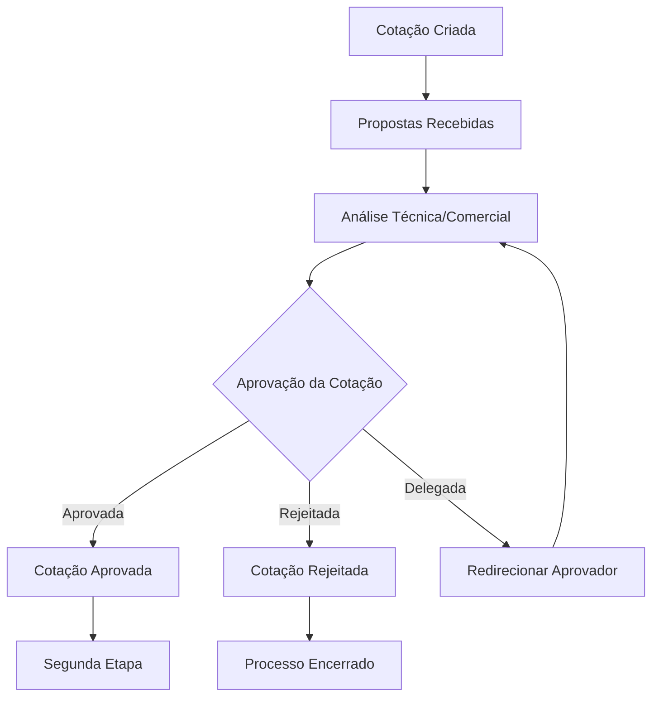
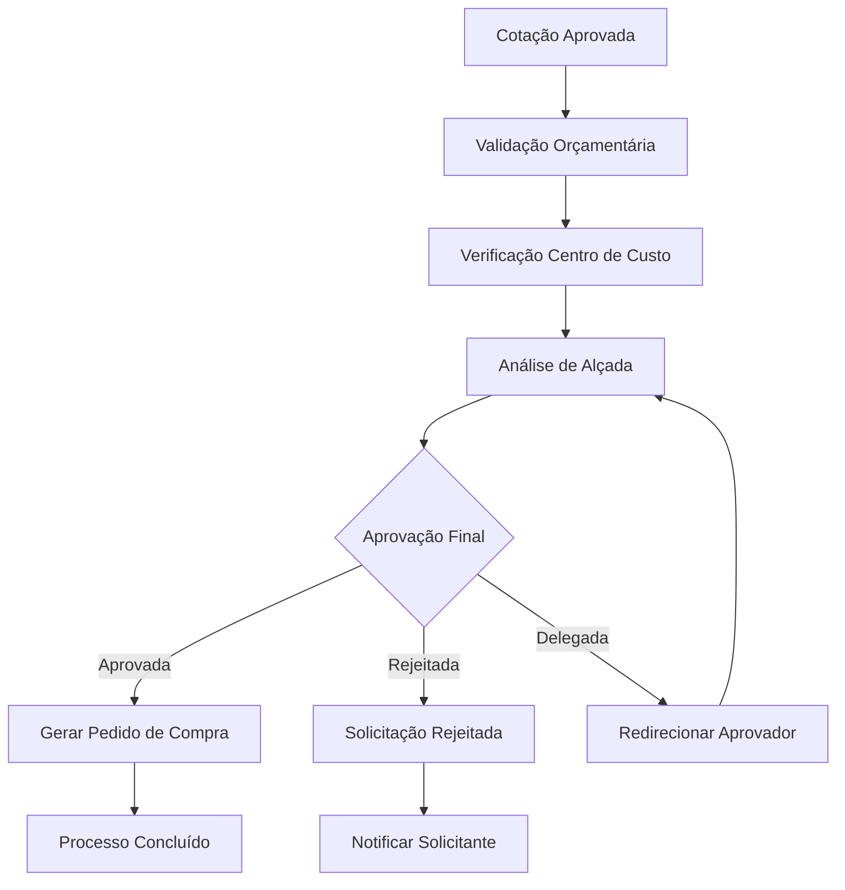

# Módulo: Compras

**Status:** 📋 Planejado  
**Categoria:** Procurement  
**Versão:** 1.0 (Planejada)  
**Responsável:** Equipe Procurement  

---

## 1. Visão Geral

O módulo Compras será responsável pela gestão completa do processo de aquisições da empresa, desde a solicitação de compra até o recebimento e pagamento dos fornecedores. Oferecerá controle total sobre o ciclo de compras, incluindo cotações, aprovações, pedidos, recebimento e gestão de fornecedores.

### Propósito
- Centralizar processo de compras
- Controlar gastos e orçamentos
- Automatizar aprovações
- Gerenciar fornecedores
- Garantir compliance

---

## 2. Objetivos e Requisitos

### Objetivos Principais
- **Eficiência:** Automatizar processo de compras
- **Controle:** Gestão de gastos e orçamentos
- **Transparência:** Rastreabilidade completa
- **Compliance:** Aderência a políticas
- **Economia:** Otimização de custos

### Requisitos Funcionais
- Solicitações de compra
- Cotações de fornecedores
- Fluxo de aprovações
- Pedidos de compra
- Recebimento de mercadorias
- Controle de estoque
- Gestão de fornecedores
- Contratos e acordos
- Relatórios e analytics
- Integração contábil

### Requisitos Não-Funcionais
- Performance: Resposta < 2s
- Escalabilidade: 10.000+ pedidos/mês
- Disponibilidade: 99.9% uptime
- Segurança: Auditoria completa
- Usabilidade: Interface intuitiva

---

## 3. Funcionalidades Planejadas

### 3.1 Solicitações de Compra
- **Criação:** Formulário de solicitação
- **Categorização:** Por tipo e urgência
- **Anexos:** Documentos e especificações
- **Aprovações:** Fluxo configurável
- **Tracking:** Acompanhamento de status

### 3.2 Cotações
- **Múltiplos Fornecedores:** Comparação de preços
- **Critérios:** Preço, prazo, qualidade
- **Negociação:** Histórico de propostas
- **Análise:** Relatórios comparativos
- **Decisão:** Justificativa de escolha

### 3.3 Sistema de Aprovação de Cotações (Duas Etapas)
- **Primeira Etapa - Aprovação de Cotação:**
  - Análise técnica e comercial das propostas
  - Avaliação de critérios (preço, prazo, qualidade, fornecedor)
  - Aprovação/rejeição de cotação específica
  - Justificativa obrigatória para decisões
  - Delegação de aprovação quando necessário
  
- **Segunda Etapa - Aprovação Final da Solicitação:**
  - Aprovação da solicitação com cotação aprovada
  - Verificação de orçamento e centro de custo
  - Validação de alçadas por valor
  - Aprovação final para geração do pedido
  - Notificações automáticas para todas as partes

- **Características do Sistema:**
  - Fluxo configurável por valor e categoria
  - Múltiplos níveis de aprovação
  - Rastreabilidade completa de decisões
  - Auditoria de todas as ações
  - Integração com notificações e relatórios

### 3.4 Pedidos de Compra
- **Geração:** A partir de cotações aprovadas
- **Aprovação:** Workflow configurável
- **Envio:** Automático para fornecedores
- **Acompanhamento:** Status em tempo real
- **Alterações:** Controle de mudanças

### 3.5 Recebimento
- **Conferência:** Quantidade e qualidade
- **Documentação:** Notas fiscais e certificados
- **Divergências:** Gestão de não conformidades
- **Aprovação:** Liberação para pagamento
- **Estoque:** Integração com inventário

### 3.6 Gestão de Fornecedores
- **Cadastro:** Dados completos
- **Qualificação:** Critérios de avaliação
- **Performance:** Métricas de desempenho
- **Contratos:** Gestão de acordos
- **Relacionamento:** Histórico de transações

---

## 4. Arquitetura Técnica Planejada

### 4.1 Estrutura de Arquivos
```
src/app/procurement/
├── page.tsx                     # Dashboard de compras
├── requests/
│   ├── page.tsx                # Lista de solicitações
│   ├── new/page.tsx            # Nova solicitação
│   ├── [id]/page.tsx           # Detalhes da solicitação
│   ├── [id]/edit/page.tsx      # Editar solicitação
│   ├── [id]/approve/page.tsx   # Aprovar solicitação
│   └── templates/page.tsx      # Templates de solicitação
├── quotations/
│   ├── page.tsx                # Lista de cotações
│   ├── new/page.tsx            # Nova cotação
│   ├── [id]/page.tsx           # Detalhes da cotação
│   ├── [id]/compare/page.tsx   # Comparar propostas
│   ├── [id]/negotiate/page.tsx # Negociar preços
│   └── analysis/page.tsx       # Análise de cotações
├── orders/
│   ├── page.tsx                # Lista de pedidos
│   ├── new/page.tsx            # Novo pedido
│   ├── [id]/page.tsx           # Detalhes do pedido
│   ├── [id]/edit/page.tsx      # Editar pedido
│   ├── [id]/approve/page.tsx   # Aprovar pedido
│   ├── [id]/send/page.tsx      # Enviar pedido
│   └── tracking/page.tsx       # Rastreamento
├── receiving/
│   ├── page.tsx                # Lista de recebimentos
│   ├── new/page.tsx            # Novo recebimento
│   ├── [id]/page.tsx           # Detalhes do recebimento
│   ├── [id]/inspect/page.tsx   # Inspeção de qualidade
│   ├── [id]/approve/page.tsx   # Aprovar recebimento
│   └── discrepancies/page.tsx  # Divergências
├── suppliers/
│   ├── page.tsx                # Lista de fornecedores
│   ├── new/page.tsx            # Novo fornecedor
│   ├── [id]/page.tsx           # Perfil do fornecedor
│   ├── [id]/edit/page.tsx      # Editar fornecedor
│   ├── [id]/performance/page.tsx # Performance
│   ├── [id]/contracts/page.tsx # Contratos
│   ├── qualification/page.tsx  # Qualificação
│   └── evaluation/page.tsx     # Avaliação
├── contracts/
│   ├── page.tsx                # Lista de contratos
│   ├── new/page.tsx            # Novo contrato
│   ├── [id]/page.tsx           # Detalhes do contrato
│   ├── [id]/edit/page.tsx      # Editar contrato
│   ├── [id]/renew/page.tsx     # Renovar contrato
│   └── templates/page.tsx      # Templates
├── budgets/
│   ├── page.tsx                # Orçamentos
│   ├── [year]/page.tsx         # Orçamento anual
│   ├── [year]/[month]/page.tsx # Orçamento mensal
│   ├── categories/page.tsx     # Categorias
│   └── analysis/page.tsx       # Análise de gastos
├── approvals/
│   ├── page.tsx                # Fila de aprovações
│   ├── pending/page.tsx        # Pendentes
│   ├── approved/page.tsx       # Aprovados
│   ├── rejected/page.tsx       # Rejeitados
│   └── workflow/page.tsx       # Configurar workflow
├── reports/
│   ├── page.tsx                # Dashboard de relatórios
│   ├── spending/page.tsx       # Relatório de gastos
│   ├── suppliers/page.tsx      # Relatório de fornecedores
│   ├── performance/page.tsx    # Performance de compras
│   ├── compliance/page.tsx     # Compliance
│   └── analytics/page.tsx      # Analytics avançado
├── components/
│   ├── RequestForm.tsx         # Formulário de solicitação
│   ├── QuotationCard.tsx       # Card de cotação
│   ├── OrderStatus.tsx         # Status do pedido
│   ├── SupplierCard.tsx        # Card de fornecedor
│   ├── ApprovalFlow.tsx        # Fluxo de aprovação
│   ├── BudgetTracker.tsx       # Rastreador de orçamento
│   ├── ReceivingForm.tsx       # Formulário de recebimento
│   ├── ContractViewer.tsx      # Visualizador de contrato
│   ├── PerformanceChart.tsx    # Gráfico de performance
│   └── ComplianceIndicator.tsx # Indicador de compliance
├── hooks/
│   ├── useProcurement.tsx      # Hook principal
│   ├── useRequests.tsx         # Hook de solicitações
│   ├── useQuotations.tsx       # Hook de cotações
│   ├── useOrders.tsx           # Hook de pedidos
│   ├── useSuppliers.tsx        # Hook de fornecedores
│   ├── useApprovals.tsx        # Hook de aprovações
│   └── useBudgets.tsx          # Hook de orçamentos
├── lib/
│   ├── procurement-engine.ts   # Engine de compras
│   ├── approval-workflow.ts    # Workflow de aprovações
│   ├── supplier-manager.ts     # Gerenciador de fornecedores
│   ├── budget-controller.ts    # Controlador de orçamento
│   ├── quotation-analyzer.ts   # Analisador de cotações
│   └── compliance-checker.ts   # Verificador de compliance
└── types/
    └── procurement.ts          # Tipos TypeScript
```

### 4.2 Modelos de Dados Planejados (Prisma)
```typescript
model SolicitacaoCompra {
  id              String    @id @default(cuid())
  
  // Dados Básicos
  numero          String    @unique
  titulo          String
  descricao       String?
  categoria       CategoriaCompra
  prioridade      PrioridadeCompra @default(NORMAL)
  
  // Solicitante
  solicitanteId   String
  solicitante     Usuario   @relation(fields: [solicitanteId], references: [id])
  departamento    String?
  centroCusto     String?
  
  // Dados Financeiros
  valorEstimado   Decimal?
  moeda           String    @default("BRL")
  justificativa   String?
  
  // Datas
  dataLimite      DateTime?
  dataEntrega     DateTime?
  
  // Status
  status          StatusSolicitacao @default(RASCUNHO)
  
  // Aprovação
  aprovacoes      AprovacaoCompra[]
  
  // Relacionamentos
  itens           ItemSolicitacao[]
  cotacoes        Cotacao[]
  pedidos         PedidoCompra[]
  
  // Metadados
  empresaId       String
  empresa         Empresa   @relation(fields: [empresaId], references: [id])
  
  createdAt       DateTime  @default(now())
  updatedAt       DateTime  @updatedAt
  
  @@map("solicitacoes_compra")
}

model ItemSolicitacao {
  id              String    @id @default(cuid())
  solicitacaoId   String
  solicitacao     SolicitacaoCompra @relation(fields: [solicitacaoId], references: [id], onDelete: Cascade)
  
  // Produto/Serviço
  codigo          String?
  nome            String
  descricao       String?
  especificacao   String?
  unidade         String
  
  // Quantidade
  quantidade      Decimal
  quantidadeRecebida Decimal @default(0)
  
  // Valores
  valorUnitario   Decimal?
  valorTotal      Decimal?
  
  // Categoria
  categoria       String?
  subcategoria    String?
  
  // Relacionamentos
  cotacaoItens    CotacaoItem[]
  pedidoItens     PedidoItem[]
  
  createdAt       DateTime  @default(now())
  
  @@map("itens_solicitacao")
}

model Fornecedor {
  id              String    @id @default(cuid())
  
  // Dados Básicos
  codigo          String    @unique
  razaoSocial     String
  nomeFantasia    String?
  cnpj            String?   @unique
  cpf             String?   @unique
  inscricaoEstadual String?
  inscricaoMunicipal String?
  
  // Contato
  email           String?
  telefone        String?
  website         String?
  
  // Endereço
  endereco        String?
  numero          String?
  complemento     String?
  bairro          String?
  cidade          String?
  estado          String?
  cep             String?
  pais            String    @default("Brasil")
  
  // Dados Bancários
  banco           String?
  agencia         String?
  conta           String?
  tipoConta       String?
  pix             String?
  
  // Classificação
  categoria       CategoriaFornecedor
  segmento        String?
  porte           PorteFornecedor?
  
  // Status
  status          StatusFornecedor @default(ATIVO)
  isQualificado   Boolean   @default(false)
  dataQualificacao DateTime?
  
  // Avaliação
  nota            Decimal?  // 0-10
  totalAvaliacoes Int       @default(0)
  
  // Relacionamentos
  cotacoes        Cotacao[]
  pedidos         PedidoCompra[]
  contratos       ContratoFornecedor[]
  avaliacoes      AvaliacaoFornecedor[]
  
  // Metadados
  empresaId       String
  empresa         Empresa   @relation(fields: [empresaId], references: [id])
  
  createdAt       DateTime  @default(now())
  updatedAt       DateTime  @updatedAt
  
  @@map("fornecedores")
}

model Cotacao {
  id              String    @id @default(cuid())
  
  // Dados Básicos
  numero          String    @unique
  titulo          String
  descricao       String?
  
  // Solicitação
  solicitacaoId   String
  solicitacao     SolicitacaoCompra @relation(fields: [solicitacaoId], references: [id])
  
  // Datas
  dataAbertura    DateTime  @default(now())
  dataFechamento  DateTime?
  prazoResposta   DateTime?
  
  // Status
  status          StatusCotacao @default(ABERTA)
  
  // Critérios
  criterios       Json?     // Critérios de avaliação
  
  // Relacionamentos
  propostas       PropostaFornecedor[]
  itens           CotacaoItem[]
  
  // Metadados
  empresaId       String
  empresa         Empresa   @relation(fields: [empresaId], references: [id])
  
  createdAt       DateTime  @default(now())
  updatedAt       DateTime  @updatedAt
  
  @@map("cotacoes")
}

model CotacaoItem {
  id              String    @id @default(cuid())
  cotacaoId       String
  cotacao         Cotacao   @relation(fields: [cotacaoId], references: [id], onDelete: Cascade)
  
  itemSolicitacaoId String
  itemSolicitacao ItemSolicitacao @relation(fields: [itemSolicitacaoId], references: [id])
  
  // Especificações
  especificacoes  String?
  observacoes     String?
  
  // Relacionamentos
  propostas       PropostaItem[]
  
  createdAt       DateTime  @default(now())
  
  @@map("cotacoes_itens")
}

model PropostaFornecedor {
  id              String    @id @default(cuid())
  
  // Cotação
  cotacaoId       String
  cotacao         Cotacao   @relation(fields: [cotacaoId], references: [id], onDelete: Cascade)
  
  // Fornecedor
  fornecedorId    String
  fornecedor      Fornecedor @relation(fields: [fornecedorId], references: [id])
  
  // Dados da Proposta
  valorTotal      Decimal
  prazoEntrega    Int       // Dias
  condicoesPagamento String?
  garantia        String?
  observacoes     String?
  
  // Status
  status          StatusProposta @default(ENVIADA)
  dataEnvio       DateTime  @default(now())
  dataResposta    DateTime?
  
  // Avaliação
  pontuacao       Decimal?  // Pontuação calculada
  isVencedora     Boolean   @default(false)
  motivoEscolha   String?
  
  // Relacionamentos
  itens           PropostaItem[]
  
  createdAt       DateTime  @default(now())
  updatedAt       DateTime  @updatedAt
  
  @@map("propostas_fornecedor")
}

model PropostaItem {
  id              String    @id @default(cuid())
  
  propostaId      String
  proposta        PropostaFornecedor @relation(fields: [propostaId], references: [id], onDelete: Cascade)
  
  cotacaoItemId   String
  cotacaoItem     CotacaoItem @relation(fields: [cotacaoItemId], references: [id])
  
  // Valores
  valorUnitario   Decimal
  valorTotal      Decimal
  
  // Especificações
  marca           String?
  modelo          String?
  especificacoes  String?
  prazoEntrega    Int?      // Dias específicos para este item
  
  createdAt       DateTime  @default(now())
  
  @@map("propostas_itens")
}

model PedidoCompra {
  id              String    @id @default(cuid())
  
  // Dados Básicos
  numero          String    @unique
  titulo          String
  descricao       String?
  
  // Origem
  solicitacaoId   String?
  solicitacao     SolicitacaoCompra? @relation(fields: [solicitacaoId], references: [id])
  
  // Fornecedor
  fornecedorId    String
  fornecedor      Fornecedor @relation(fields: [fornecedorId], references: [id])
  
  // Dados Financeiros
  valorTotal      Decimal
  valorDesconto   Decimal   @default(0)
  valorFrete      Decimal   @default(0)
  valorImpostos   Decimal   @default(0)
  valorLiquido    Decimal
  moeda           String    @default("BRL")
  
  // Condições
  condicoesPagamento String?
  prazoEntrega    Int?      // Dias
  localEntrega    String?
  
  // Datas
  dataEmissao     DateTime  @default(now())
  dataEntrega     DateTime?
  dataVencimento  DateTime?
  
  // Status
  status          StatusPedido @default(RASCUNHO)
  
  // Aprovação
  aprovacoes      AprovacaoPedido[]
  
  // Relacionamentos
  itens           PedidoItem[]
  recebimentos    RecebimentoMercadoria[]
  
  // Metadados
  empresaId       String
  empresa         Empresa   @relation(fields: [empresaId], references: [id])
  
  createdAt       DateTime  @default(now())
  updatedAt       DateTime  @updatedAt
  
  @@map("pedidos_compra")
}

model PedidoItem {
  id              String    @id @default(cuid())
  pedidoId        String
  pedido          PedidoCompra @relation(fields: [pedidoId], references: [id], onDelete: Cascade)
  
  itemSolicitacaoId String?
  itemSolicitacao ItemSolicitacao? @relation(fields: [itemSolicitacaoId], references: [id])
  
  // Produto/Serviço
  codigo          String?
  nome            String
  descricao       String?
  unidade         String
  
  // Quantidade
  quantidade      Decimal
  quantidadeRecebida Decimal @default(0)
  quantidadePendente Decimal
  
  // Valores
  valorUnitario   Decimal
  valorTotal      Decimal
  valorDesconto   Decimal   @default(0)
  
  // Relacionamentos
  recebimentoItens RecebimentoItem[]
  
  createdAt       DateTime  @default(now())
  
  @@map("pedidos_itens")
}

model RecebimentoMercadoria {
  id              String    @id @default(cuid())
  
  // Dados Básicos
  numero          String    @unique
  
  // Pedido
  pedidoId        String
  pedido          PedidoCompra @relation(fields: [pedidoId], references: [id])
  
  // Dados do Recebimento
  dataRecebimento DateTime  @default(now())
  responsavelId   String
  responsavel     Usuario   @relation(fields: [responsavelId], references: [id])
  
  // Documentos
  numeroNF        String?
  dataEmissaoNF   DateTime?
  valorNF         Decimal?
  
  // Status
  status          StatusRecebimento @default(PENDENTE)
  
  // Observações
  observacoes     String?
  divergencias    String?
  
  // Relacionamentos
  itens           RecebimentoItem[]
  
  // Metadados
  empresaId       String
  empresa         Empresa   @relation(fields: [empresaId], references: [id])
  
  createdAt       DateTime  @default(now())
  updatedAt       DateTime  @updatedAt
  
  @@map("recebimentos_mercadoria")
}

model RecebimentoItem {
  id              String    @id @default(cuid())
  recebimentoId   String
  recebimento     RecebimentoMercadoria @relation(fields: [recebimentoId], references: [id], onDelete: Cascade)
  
  pedidoItemId    String
  pedidoItem      PedidoItem @relation(fields: [pedidoItemId], references: [id])
  
  // Quantidades
  quantidadePedida    Decimal
  quantidadeRecebida  Decimal
  quantidadeRejeitada Decimal @default(0)
  
  // Qualidade
  statusQualidade StatusQualidade @default(APROVADO)
  motivoRejeicao  String?
  
  // Observações
  observacoes     String?
  
  createdAt       DateTime  @default(now())
  
  @@map("recebimentos_itens")
}

model ContratoFornecedor {
  id              String    @id @default(cuid())
  
  // Dados Básicos
  numero          String    @unique
  titulo          String
  descricao       String?
  
  // Fornecedor
  fornecedorId    String
  fornecedor      Fornecedor @relation(fields: [fornecedorId], references: [id])
  
  // Tipo
  tipo            TipoContrato
  categoria       String?
  
  // Vigência
  dataInicio      DateTime
  dataFim         DateTime
  prazoMeses      Int?
  isRenovavel     Boolean   @default(false)
  
  // Valores
  valorTotal      Decimal?
  valorMensal     Decimal?
  moeda           String    @default("BRL")
  
  // Condições
  condicoesPagamento String?
  sla             String?
  penalidades     String?
  
  // Status
  status          StatusContrato @default(ATIVO)
  
  // Documentos
  arquivoContrato String?
  anexos          Json?
  
  // Relacionamentos
  pedidos         PedidoCompra[]
  
  // Metadados
  empresaId       String
  empresa         Empresa   @relation(fields: [empresaId], references: [id])
  
  createdAt       DateTime  @default(now())
  updatedAt       DateTime  @updatedAt
  
  @@map("contratos_fornecedor")
}

model AvaliacaoFornecedor {
  id              String    @id @default(cuid())
  
  // Fornecedor
  fornecedorId    String
  fornecedor      Fornecedor @relation(fields: [fornecedorId], references: [id], onDelete: Cascade)
  
  // Avaliador
  avaliadorId     String
  avaliador       Usuario   @relation(fields: [avaliadorId], references: [id])
  
  // Período
  periodo         String    // Ex: "2024-01"
  dataAvaliacao   DateTime  @default(now())
  
  // Critérios (0-10)
  qualidadeProduto    Decimal
  prazoEntrega        Decimal
  atendimento         Decimal
  precoCompetitivo    Decimal
  flexibilidade       Decimal
  
  // Nota Final
  notaFinal       Decimal   // Média ponderada
  
  // Comentários
  pontosFortres   String?
  pontosFragos    String?
  sugestoes       String?
  
  // Metadados
  empresaId       String
  empresa         Empresa   @relation(fields: [empresaId], references: [id])
  
  createdAt       DateTime  @default(now())
  
  @@map("avaliacoes_fornecedor")
}

model AprovacaoCompra {
  id              String    @id @default(cuid())
  
  // Solicitação
  solicitacaoId   String
  solicitacao     SolicitacaoCompra @relation(fields: [solicitacaoId], references: [id], onDelete: Cascade)
  
  // Aprovador
  aprovadorId     String
  aprovador       Usuario   @relation(fields: [aprovadorId], references: [id])
  
  // Nível
  nivel           Int       // Ordem de aprovação
  isObrigatorio   Boolean   @default(true)
  
  // Status
  status          StatusAprovacao @default(PENDENTE)
  dataAprovacao   DateTime?
  
  // Justificativa
  comentarios     String?
  motivoRejeicao  String?
  
  createdAt       DateTime  @default(now())
  updatedAt       DateTime  @updatedAt
  
  @@map("aprovacoes_compra")
}

model AprovacaoPedido {
  id              String    @id @default(cuid())
  
  // Pedido
  pedidoId        String
  pedido          PedidoCompra @relation(fields: [pedidoId], references: [id], onDelete: Cascade)
  
  // Aprovador
  aprovadorId     String
  aprovador       Usuario   @relation(fields: [aprovadorId], references: [id])
  
  // Nível
  nivel           Int       // Ordem de aprovação
  isObrigatorio   Boolean   @default(true)
  
  // Status
  status          StatusAprovacao @default(PENDENTE)
  dataAprovacao   DateTime?
  
  // Justificativa
  comentarios     String?
  motivoRejeicao  String?
  
  createdAt       DateTime  @default(now())
  updatedAt       DateTime  @updatedAt
  
  @@map("aprovacoes_pedido")
}

model AprovacaoCotacao {
  id                String    @id @default(cuid())
  
  // Cotação
  cotacaoId         String    @unique
  cotacao           Cotacao   @relation(fields: [cotacaoId], references: [id])
  
  // Aprovação
  status            StatusAprovacaoCotacao @default(PENDENTE)
  aprovadorId       String?
  aprovador         Usuario?  @relation("AprovadorCotacao", fields: [aprovadorId], references: [id])
  dataAprovacao     DateTime?
  justificativa     String?
  
  // Delegação
  delegadoParaId    String?
  delegadoPara      Usuario?  @relation("DelegadoCotacao", fields: [delegadoParaId], references: [id])
  motivoDelegacao   String?
  
  // Critérios de Avaliação
  notaPreco         Decimal?  // 0-10
  notaPrazo         Decimal?  // 0-10
  notaQualidade     Decimal?  // 0-10
  notaFornecedor    Decimal?  // 0-10
  notaFinal         Decimal?  // 0-10
  
  // Observações
  observacoes       String?
  anexos            Json?     // URLs de documentos
  
  // Metadados
  empresaId         String
  empresa           Empresa   @relation(fields: [empresaId], references: [id])
  
  createdAt         DateTime  @default(now())
  updatedAt         DateTime  @updatedAt
  
  @@map("aprovacoes_cotacao")
}

model LogAprovacao {
  id                String    @id @default(cuid())
  
  // Referência
  entidadeId        String    // ID da cotação ou solicitação
  entidadeTipo      TipoEntidadeAprovacao // COTACAO, SOLICITACAO
  
  // Ação
  acao              AcaoAprovacao // APROVADA, REJEITADA, DELEGADA, COMENTARIO
  usuarioId         String
  usuario           Usuario   @relation(fields: [usuarioId], references: [id])
  
  // Detalhes
  justificativa     String?
  observacoes       String?
  dadosAntes        Json?     // Estado anterior
  dadosDepois       Json?     // Estado posterior
  
  // Metadados
  ip                String?
  userAgent         String?
  timestamp         DateTime  @default(now())
  
  @@map("logs_aprovacao")
}

model ConfiguracaoAprovacao {
  id                String    @id @default(cuid())
  
  // Configuração
  nome              String
  descricao         String?
  
  // Critérios
  valorMinimo       Decimal
  valorMaximo       Decimal
  categoria         CategoriaCompra?
  centroCusto       String?
  
  // Aprovadores
  rolesAprovadores  Json      // Array de roles
  aprovadoresIds    Json?     // Array de IDs específicos
  
  // Regras
  requererJustificativa Boolean @default(false)
  requererAnexos    Boolean   @default(false)
  tempoLimiteHoras  Int?      // Tempo limite para aprovação
  
  // Status
  ativo             Boolean   @default(true)
  
  // Metadados
  empresaId         String
  empresa           Empresa   @relation(fields: [empresaId], references: [id])
  
  createdAt         DateTime  @default(now())
  updatedAt         DateTime  @updatedAt
  
  @@map("configuracoes_aprovacao")
}

model OrcamentoCompras {
  id              String    @id @default(cuid())
  
  // Período
  ano             Int
  mes             Int?      // null = anual
  
  // Categoria
  categoria       CategoriaCompra
  centroCusto     String?
  departamento    String?
  
  // Valores
  valorOrcado     Decimal
  valorGasto      Decimal   @default(0)
  valorDisponivel Decimal
  
  // Status
  status          StatusOrcamento @default(ATIVO)
  
  // Metadados
  empresaId       String
  empresa         Empresa   @relation(fields: [empresaId], references: [id])
  
  createdAt       DateTime  @default(now())
  updatedAt       DateTime  @updatedAt
  
  @@unique([empresaId, ano, mes, categoria, centroCusto])
  @@map("orcamentos_compras")
}

enum CategoriaCompra {
  MATERIAIS
  SERVICOS
  EQUIPAMENTOS
  SOFTWARE
  MANUTENCAO
  MARKETING
  VIAGEM
  TREINAMENTO
  CONSULTORIA
  OUTROS
}

enum PrioridadeCompra {
  BAIXA
  NORMAL
  ALTA
  URGENTE
  CRITICA
}

enum StatusSolicitacao {
  RASCUNHO
  ENVIADA
  EM_APROVACAO
  APROVADA
  REJEITADA
  EM_COTACAO
  COTADA
  FINALIZADA
  CANCELADA
}

enum CategoriaFornecedor {
  MATERIAIS
  SERVICOS
  EQUIPAMENTOS
  SOFTWARE
  LOGISTICA
  CONSULTORIA
  MANUTENCAO
  OUTROS
}

enum PorteFornecedor {
  MICRO
  PEQUENO
  MEDIO
  GRANDE
}

enum StatusFornecedor {
  ATIVO
  INATIVO
  BLOQUEADO
  EM_QUALIFICACAO
  SUSPENSO
}

enum StatusCotacao {
  RASCUNHO
  ABERTA
  EM_ANALISE
  FINALIZADA
  CANCELADA
}

enum StatusProposta {
  RASCUNHO
  ENVIADA
  EM_ANALISE
  ACEITA
  REJEITADA
  VENCEDORA
}

enum StatusPedido {
  RASCUNHO
  EM_APROVACAO
  APROVADO
  ENVIADO
  CONFIRMADO
  EM_ENTREGA
  ENTREGUE
  FINALIZADO
  CANCELADO
}

enum StatusRecebimento {
  PENDENTE
  PARCIAL
  COMPLETO
  COM_DIVERGENCIA
  REJEITADO
}

enum StatusQualidade {
  APROVADO
  REJEITADO
  EM_ANALISE
  CONDICIONAL
}

enum TipoContrato {
  FORNECIMENTO
  SERVICO
  MANUTENCAO
  LOCACAO
  CONSULTORIA
  SOFTWARE
  OUTROS
}

enum StatusContrato {
  RASCUNHO
  ATIVO
  SUSPENSO
  VENCIDO
  CANCELADO
  RENOVADO
}

enum StatusAprovacao {
  PENDENTE
  APROVADO
  REJEITADO
  DELEGADO
}

enum StatusOrcamento {
  ATIVO
  BLOQUEADO
  EXCEDIDO
  FINALIZADO
}

enum StatusAprovacaoCotacao {
  PENDENTE
  APROVADA
  REJEITADA
  DELEGADA
  EXPIRADA
}

enum TipoEntidadeAprovacao {
  COTACAO
  SOLICITACAO
  PEDIDO
}

enum AcaoAprovacao {
  APROVADA
  REJEITADA
  DELEGADA
  COMENTARIO
  SOLICITACAO_INFORMACAO
}
```

### 4.3 Hooks Customizados Planejados
- **useProcurement:** Hook principal de compras
- **useRequests:** Gestão de solicitações
- **useQuotations:** Cotações e propostas
- **useOrders:** Pedidos de compra
- **useSuppliers:** Gestão de fornecedores
- **useApprovals:** Gestão de aprovações (cotações e solicitações)
- **useApprovalConfig:** Configuração de regras de aprovação
- **useApprovalHistory:** Histórico e auditoria de aprovações
- **useDelegation:** Delegação de aprovações
- **useApprovalNotifications:** Notificações de aprovação

---

## 5. APIs e Endpoints Planejados

### 5.1 Endpoints Principais
```typescript
// Solicitações de Compra
GET    /api/procurement/requests           # Listar solicitações
POST   /api/procurement/requests           # Criar solicitação
GET    /api/procurement/requests/[id]      # Buscar solicitação
PUT    /api/procurement/requests/[id]      # Atualizar solicitação
DELETE /api/procurement/requests/[id]      # Deletar solicitação
POST   /api/procurement/requests/[id]/approve # Aprovar solicitação
POST   /api/procurement/requests/[id]/reject  # Rejeitar solicitação

// Cotações
GET    /api/procurement/quotations         # Listar cotações
POST   /api/procurement/quotations         # Criar cotação
GET    /api/procurement/quotations/[id]    # Buscar cotação
PUT    /api/procurement/quotations/[id]    # Atualizar cotação
DELETE /api/procurement/quotations/[id]    # Deletar cotação
POST   /api/procurement/quotations/[id]/close # Fechar cotação
GET    /api/procurement/quotations/[id]/analysis # Análise de propostas

// Pedidos de Compra
GET    /api/procurement/orders             # Listar pedidos
POST   /api/procurement/orders             # Criar pedido
GET    /api/procurement/orders/[id]        # Buscar pedido
PUT    /api/procurement/orders/[id]        # Atualizar pedido
DELETE /api/procurement/orders/[id]        # Deletar pedido
POST   /api/procurement/orders/[id]/send   # Enviar pedido
POST   /api/procurement/orders/[id]/approve # Aprovar pedido

// Fornecedores
GET    /api/procurement/suppliers          # Listar fornecedores
POST   /api/procurement/suppliers          # Criar fornecedor
GET    /api/procurement/suppliers/[id]     # Buscar fornecedor
PUT    /api/procurement/suppliers/[id]     # Atualizar fornecedor
DELETE /api/procurement/suppliers/[id]     # Deletar fornecedor
POST   /api/procurement/suppliers/[id]/qualify # Qualificar fornecedor
GET    /api/procurement/suppliers/[id]/performance # Performance

// Recebimentos
GET    /api/procurement/receiving          # Listar recebimentos
POST   /api/procurement/receiving          # Criar recebimento
GET    /api/procurement/receiving/[id]     # Buscar recebimento
PUT    /api/procurement/receiving/[id]     # Atualizar recebimento
POST   /api/procurement/receiving/[id]/approve # Aprovar recebimento

// Sistema de Aprovação de Cotações
GET    /api/procurement/approvals/quotations/pending    # Cotações pendentes de aprovação
POST   /api/procurement/approvals/quotations/[id]/approve # Aprovar cotação
POST   /api/procurement/approvals/quotations/[id]/reject  # Rejeitar cotação
POST   /api/procurement/approvals/quotations/[id]/delegate # Delegar aprovação
GET    /api/procurement/approvals/quotations/[id]/history # Histórico de aprovação

// Aprovação Final de Solicitações
GET    /api/procurement/approvals/requests/pending      # Solicitações pendentes de aprovação final
POST   /api/procurement/approvals/requests/[id]/approve # Aprovação final da solicitação
POST   /api/procurement/approvals/requests/[id]/reject  # Rejeitar solicitação final
GET    /api/procurement/approvals/requests/[id]/history # Histórico de aprovação

// Configuração de Aprovação
GET    /api/procurement/approvals/config               # Listar configurações
POST   /api/procurement/approvals/config               # Criar configuração
PUT    /api/procurement/approvals/config/[id]          # Atualizar configuração
DELETE /api/procurement/approvals/config/[id]          # Deletar configuração

// Relatórios de Aprovação
GET    /api/procurement/approvals/reports/dashboard    # Dashboard de aprovações
GET    /api/procurement/approvals/reports/performance  # Performance de aprovadores
GET    /api/procurement/approvals/reports/audit        # Relatório de auditoria

// Contratos
GET    /api/procurement/contracts          # Listar contratos
POST   /api/procurement/contracts          # Criar contrato
GET    /api/procurement/contracts/[id]     # Buscar contrato
PUT    /api/procurement/contracts/[id]     # Atualizar contrato
POST   /api/procurement/contracts/[id]/renew # Renovar contrato

// Orçamentos
GET    /api/procurement/budgets            # Listar orçamentos
POST   /api/procurement/budgets            # Criar orçamento
GET    /api/procurement/budgets/[id]       # Buscar orçamento
PUT    /api/procurement/budgets/[id]       # Atualizar orçamento
GET    /api/procurement/budgets/analysis   # Análise de gastos

// Aprovações
GET    /api/procurement/approvals          # Fila de aprovações
POST   /api/procurement/approvals/[id]/approve # Aprovar
POST   /api/procurement/approvals/[id]/reject  # Rejeitar
GET    /api/procurement/approvals/workflow # Configurar workflow

// Relatórios
GET    /api/procurement/reports/spending   # Relatório de gastos
GET    /api/procurement/reports/suppliers  # Relatório de fornecedores
GET    /api/procurement/reports/performance # Performance de compras
GET    /api/procurement/reports/compliance # Compliance
```

---

## 6. Componentes de Interface Planejados

### 6.1 Páginas Principais
- **Dashboard:** Visão geral de compras
- **Solicitações:** Gestão de solicitações
- **Cotações:** Comparação de propostas
- **Pedidos:** Acompanhamento de pedidos
- **Fornecedores:** Gestão de fornecedores
- **Aprovações:** Central de aprovações (cotações e solicitações)
- **Configuração de Aprovação:** Gestão de regras e níveis

### 6.2 Componentes Reutilizáveis
- **RequestForm:** Formulário de solicitação
- **QuotationCard:** Card de cotação
- **SupplierCard:** Card de fornecedor
- **ApprovalFlow:** Fluxo de aprovação
- **BudgetTracker:** Rastreador de orçamento
- **ApprovalCard:** Card de aprovação pendente
- **ApprovalHistory:** Histórico de aprovações
- **ApprovalConfig:** Configurador de regras
- **DelegationModal:** Modal de delegação
- **ApprovalDashboard:** Dashboard de aprovações

### 6.3 Estados de Interface
- Loading: Carregamento
- Pending: Aguardando aprovação
- Approved: Aprovado
- Rejected: Rejeitado
- In Progress: Em andamento
- Delegated: Delegado para outro aprovador
- Expired: Aprovação expirada
- Under Review: Em análise técnica
- Awaiting Final: Aguardando aprovação final

---

## 7. Permissões e Segurança

### 7.1 Permissões Necessárias
```typescript
const PROCUREMENT_PERMISSIONS = [
  'procurement.read',           # Ver dados de compras
  'procurement.write',          # Criar/editar
  'procurement.delete',         # Deletar
  'procurement.approve',        # Aprovar solicitações/pedidos
  'suppliers.read',             # Ver fornecedores
  'suppliers.write',            # Criar/editar fornecedores
  'suppliers.qualify',          # Qualificar fornecedores
  'budgets.read',               # Ver orçamentos
  'budgets.write',              # Criar/editar orçamentos
  'contracts.read',             # Ver contratos
  'contracts.write',            # Criar/editar contratos
  'procurement.admin',          # Administração completa
  
  // Permissões do Sistema de Aprovação
  'quotations.approve.level1',  # Aprovação de cotações (1ª etapa)
  'quotations.approve.level2',  # Aprovação de cotações (2ª etapa)
  'quotations.approve.level3',  # Aprovação de cotações (3ª etapa)
  'requests.approve.final',     # Aprovação final de solicitações
  'approvals.delegate',         # Delegar aprovações
  'approvals.config',           # Configurar regras de aprovação
  'approvals.reports',          # Relatórios de aprovação
  'approvals.audit',            # Auditoria de aprovações
  'approvals.override'          # Sobrescrever aprovações (emergência)
];
```

### 7.2 Níveis de Acesso
- **Solicitante:** Criar solicitações
- **Comprador:** Gestão de cotações e pedidos
- **Aprovador Nível 1:** Aprovação técnica/comercial de cotações
- **Aprovador Nível 2:** Aprovação gerencial de cotações
- **Aprovador Nível 3:** Aprovação executiva de cotações
- **Aprovador Final:** Aprovação final de solicitações de compra
- **Gestor de Aprovação:** Configurar regras e delegar aprovações
- **Gestor:** Gestão completa do módulo
- **Admin:** Administração total do sistema

### 7.3 Segurança Implementada
- Workflow de aprovações
- Auditoria completa
- Controle de orçamentos
- Validação de fornecedores
- Isolamento por empresa

---

## 8. Integrações Planejadas

### 8.1 Módulos Internos

#### 8.1.1 Integração com Módulo de Estoque
- **Entrada de Produtos:** Recebimento de mercadorias gera movimentação de entrada no estoque
- **Classificação Automática:** Produtos são classificados automaticamente como estoque ou ativo
- **Centro de Custo:** Vinculação automática ao centro de custo da solicitação
- **Saldo Disponível:** Consulta de saldo antes de criar solicitações
- **Reserva de Produtos:** Reserva automática de itens em cotações aprovadas
- **Localização:** Definição automática de localização no recebimento
- **Inventário:** Sincronização com inventários físicos

**APIs de Integração:**
```typescript
// Webhook para entrada de produtos
POST /api/estoque/webhook/entrada-compra
{
  pedidoId: string,
  itens: Array<{
    produtoId: string,
    quantidade: number,
    valorUnitario: number,
    centroCusto: string,
    localizacao?: string
  }>
}

// Consulta de saldo disponível
GET /api/estoque/saldo/{produtoId}?centroCusto={id}

// Reserva de produtos
POST /api/estoque/reserva
{
  cotacaoId: string,
  itens: Array<{
    produtoId: string,
    quantidade: number
  }>
}
```

#### 8.1.2 Integração com Módulo de Tombamento
- **Classificação de Ativos:** Produtos com valor > R$ 1.000 são automaticamente classificados como ativos
- **Tombamento Automático:** Geração automática de número de tombamento no recebimento
- **Depreciação:** Início automático do cálculo de depreciação
- **Localização Inicial:** Definição do setor/localização inicial do ativo
- **Responsável:** Atribuição automática do responsável pelo ativo
- **Garantia:** Controle automático de garantias e manutenções

**APIs de Integração:**
```typescript
// Webhook para criação de ativo
POST /api/tombamento/webhook/novo-ativo
{
  pedidoId: string,
  itemId: string,
  produto: {
    nome: string,
    categoria: string,
    valor: number,
    fornecedor: string,
    notaFiscal: string,
    dataAquisicao: Date
  },
  localizacao: {
    setorId: string,
    responsavelId: string
  }
}

// Consulta de ativos por pedido
GET /api/tombamento/ativos/pedido/{pedidoId}
```

#### 8.1.3 Integração com Centro de Custo
- **Orçamento por Centro:** Controle de orçamento específico por centro de custo
- **Aprovação Hierárquica:** Workflow de aprovação baseado na hierarquia do centro de custo
- **Rateio de Custos:** Distribuição automática de custos entre centros
- **Relatórios Segmentados:** Relatórios específicos por centro de custo

#### 8.1.4 Outras Integrações Internas
- **Financeiro:** Contas a pagar e fluxo de caixa
- **Contabilidade:** Lançamentos contábeis automáticos
- **Aprovações:** Workflow de aprovações configurável
- **Relatórios:** Analytics e dashboards integrados
- **Notificações:** Alertas automáticos de status
- **Usuários:** Controle de permissões e responsabilidades

### 8.2 Sistemas Externos
- **ERP:** Integração com sistemas ERP existentes
- **E-procurement:** Plataformas de compras eletrônicas
- **Bancos:** Pagamentos eletrônicos e conciliação
- **Receita Federal:** Validação de CNPJ e situação fiscal
- **Correios:** Rastreamento de entregas e logística
- **NFe:** Recepção e processamento de notas fiscais eletrônicas

### 8.3 APIs de Terceiros
- **CNPJ API:** Validação e dados de fornecedores
- **ViaCEP:** Preenchimento automático de endereços
- **Banco Central:** Cotações de moeda para importações
- **E-mail/SMS:** Notificações automáticas
- **WhatsApp Business:** Comunicação com fornecedores

---

## 9. Sistema de Aprovação de Cotações (Duas Etapas)

### 9.1 Visão Geral do Processo
O sistema implementa um fluxo de aprovação em duas etapas distintas para garantir controle total sobre o processo de compras:

1. **Primeira Etapa:** Aprovação da cotação específica
2. **Segunda Etapa:** Aprovação final da solicitação de compra

### 9.2 Fluxo Detalhado

#### 9.2.1 Primeira Etapa - Aprovação de Cotação


**Critérios de Avaliação:**
- Preço competitivo
- Prazo de entrega adequado
- Qualidade do fornecedor
- Conformidade técnica
- Disponibilidade orçamentária

**Responsáveis:**
- Aprovadores técnicos (até R$ 10.000)
- Gerentes de compras (R$ 10.001 - R$ 50.000)
- Diretores (acima de R$ 50.000)

#### 9.2.2 Segunda Etapa - Aprovação Final da Solicitação


**Validações Automáticas:**
- Saldo orçamentário disponível
- Limites do centro de custo
- Alçadas por valor
- Políticas de compras
- Conformidade regulatória

### 9.3 Modelos de Dados para Aprovação

#### 9.3.1 Modelo AprovacaoCotacao
```typescript
model AprovacaoCotacao {
  id                String    @id @default(cuid())
  
  // Cotação
  cotacaoId         String    @unique
  cotacao           Cotacao   @relation(fields: [cotacaoId], references: [id])
  
  // Aprovação
  status            StatusAprovacaoCotacao @default(PENDENTE)
  aprovadorId       String?
  aprovador         Usuario?  @relation("AprovadorCotacao", fields: [aprovadorId], references: [id])
  dataAprovacao     DateTime?
  justificativa     String?
  
  // Delegação
  delegadoParaId    String?
  delegadoPara      Usuario?  @relation("DelegadoCotacao", fields: [delegadoParaId], references: [id])
  motivoDelegacao   String?
  
  // Critérios de Avaliação
  notaPreco         Decimal?  // 0-10
  notaPrazo         Decimal?  // 0-10
  notaQualidade     Decimal?  // 0-10
  notaFornecedor    Decimal?  // 0-10
  notaFinal         Decimal?  // 0-10
  
  // Observações
  observacoes       String?
  anexos            Json?     // URLs de documentos
  
  // Metadados
  empresaId         String
  empresa           Empresa   @relation(fields: [empresaId], references: [id])
  
  createdAt         DateTime  @default(now())
  updatedAt         DateTime  @updatedAt
  
  @@map("aprovacoes_cotacao")
}
```

#### 9.3.2 Modelo LogAprovacao
```typescript
model LogAprovacao {
  id                String    @id @default(cuid())
  
  // Referência
  entidadeId        String    // ID da cotação ou solicitação
  entidadeTipo      TipoEntidadeAprovacao // COTACAO, SOLICITACAO
  
  // Ação
  acao              AcaoAprovacao // APROVADA, REJEITADA, DELEGADA, COMENTARIO
  usuarioId         String
  usuario           Usuario   @relation(fields: [usuarioId], references: [id])
  
  // Detalhes
  justificativa     String?
  observacoes       String?
  dadosAntes        Json?     // Estado anterior
  dadosDepois       Json?     // Estado posterior
  
  // Metadados
  ip                String?
  userAgent         String?
  timestamp         DateTime  @default(now())
  
  @@map("logs_aprovacao")
}
```

### 9.4 APIs do Sistema de Aprovação

#### 9.4.1 Endpoints para Cotações
```typescript
// Listar cotações pendentes de aprovação
GET /api/compras/cotacoes/pendentes-aprovacao
Query: { aprovadorId?, centroCusto?, valor_min?, valor_max? }

// Aprovar cotação
POST /api/compras/cotacoes/{id}/aprovar
Body: {
  justificativa: string,
  criterios: {
    notaPreco: number,
    notaPrazo: number,
    notaQualidade: number,
    notaFornecedor: number
  },
  observacoes?: string
}

// Rejeitar cotação
POST /api/compras/cotacoes/{id}/rejeitar
Body: {
  justificativa: string,
  observacoes?: string
}

// Delegar aprovação
POST /api/compras/cotacoes/{id}/delegar
Body: {
  delegadoParaId: string,
  motivoDelegacao: string
}
```

#### 9.4.2 Endpoints para Solicitações
```typescript
// Listar solicitações pendentes de aprovação final
GET /api/compras/solicitacoes/pendentes-aprovacao-final

// Aprovar solicitação final
POST /api/compras/solicitacoes/{id}/aprovar-final
Body: {
  justificativa: string,
  observacoes?: string
}

// Rejeitar solicitação final
POST /api/compras/solicitacoes/{id}/rejeitar-final
Body: {
  justificativa: string,
  observacoes?: string
}
```

### 9.5 Configuração de Alçadas

#### 9.5.1 Níveis de Aprovação por Valor
```typescript
interface ConfiguracaoAprovacao {
  valorMinimo: number;
  valorMaximo: number;
  rolesAprovadores: string[];
  requererJustificativa: boolean;
  requererAnexos: boolean;
  tempoLimiteHoras: number;
}

// Exemplo de configuração
const alçadas: ConfiguracaoAprovacao[] = [
  {
    valorMinimo: 0,
    valorMaximo: 1000,
    rolesAprovadores: ["APROVADOR_NIVEL_1"],
    requererJustificativa: false,
    requererAnexos: false,
    tempoLimiteHoras: 24
  },
  {
    valorMinimo: 1001,
    valorMaximo: 10000,
    rolesAprovadores: ["APROVADOR_NIVEL_2", "GERENTE_COMPRAS"],
    requererJustificativa: true,
    requererAnexos: false,
    tempoLimiteHoras: 48
  },
  {
    valorMinimo: 10001,
    valorMaximo: 50000,
    rolesAprovadores: ["GERENTE_COMPRAS", "DIRETOR"],
    requererJustificativa: true,
    requererAnexos: true,
    tempoLimiteHoras: 72
  }
];
```

### 9.6 Notificações e Comunicação

#### 9.6.1 Webhooks Automáticos
```typescript
// Cotação pendente de aprovação
POST /webhook/cotacao-pendente-aprovacao
{
  cotacaoId: string,
  solicitacaoId: string,
  aprovadorId: string,
  valor: number,
  prazoLimite: Date
}

// Cotação aprovada
POST /webhook/cotacao-aprovada
{
  cotacaoId: string,
  solicitacaoId: string,
  aprovadorId: string,
  dataAprovacao: Date
}

// Solicitação pendente de aprovação final
POST /webhook/solicitacao-pendente-aprovacao-final
{
  solicitacaoId: string,
  cotacaoAprovadaId: string,
  aprovadorId: string,
  valor: number
}
```

### 9.7 Relatórios e Auditoria

#### 9.7.1 Relatórios de Aprovação
- **Tempo Médio de Aprovação:** Por aprovador e categoria
- **Taxa de Aprovação:** Percentual de aprovações vs. rejeições
- **Gargalos:** Identificação de pontos de lentidão
- **Compliance:** Aderência às políticas de aprovação

#### 9.7.2 Trilha de Auditoria
- Histórico completo de todas as ações
- Logs de acesso e modificações
- Rastreabilidade de decisões
- Relatórios de conformidade

---

## 10. Cronograma de Implementação

### 10.1 Fase 1 - Fundação (4 semanas)
- ✅ **Semana 1:** Arquitetura e modelos de dados
- ✅ **Semana 2:** Gestão de fornecedores
- ✅ **Semana 3:** Solicitações de compra
- ✅ **Semana 4:** Sistema de aprovações básico

### 10.2 Fase 2 - Cotações e Aprovação (5 semanas)
- 📋 **Semana 5:** Sistema de cotações
- 📋 **Semana 6:** Propostas de fornecedores
- 📋 **Semana 7:** Sistema de aprovação de cotações (Primeira Etapa)
- 📋 **Semana 8:** Sistema de aprovação final de solicitações (Segunda Etapa)
- 📋 **Semana 9:** Análise comparativa e seleção de propostas

### 10.3 Fase 3 - Pedidos (4 semanas)
- 📋 **Semana 10:** Pedidos de compra
- 📋 **Semana 11:** Envio e confirmação
- 📋 **Semana 12:** Acompanhamento
- 📋 **Semana 13:** Recebimento de mercadorias

### 10.4 Fase 4 - Contratos e Orçamentos (4 semanas)
- 📋 **Semana 14:** Gestão de contratos
- 📋 **Semana 15:** Controle de orçamentos
- 📋 **Semana 16:** Relatórios e analytics
- 📋 **Semana 17:** Integrações e testes finais

### 10.5 Melhorias Futuras
- 📋 **Q2 2025:** IA para análise de propostas
- 📋 **Q3 2025:** Marketplace de fornecedores
- 📋 **Q4 2025:** Automação avançada

---

## 11. Testes e Validação

### 11.1 Estratégia de Testes
- **Unitários:** Componentes e hooks
- **Integração:** Fluxos de compras
- **E2E:** Cenários completos
- **Performance:** Carga e stress

### 11.2 Critérios de Aceitação
- ✅ Solicitações funcionando
- ✅ Cotações comparativas
- ✅ Pedidos rastreáveis
- ✅ Fornecedores qualificados
- ✅ Orçamentos controlados
- ✅ Relatórios precisos
- ✅ Interface intuitiva

### 11.3 Métricas de Qualidade
- Cobertura de testes: >90%
- Performance: <2s resposta
- Disponibilidade: 99.9%
- Precisão de dados: 99.5%

---

## 12. Melhorias Futuras do Sistema de Aprovação

### 12.1 Inteligência Artificial
- **Aprovação Automática:** IA para aprovar automaticamente cotações de baixo risco
- **Análise Preditiva:** Previsão de tempo de aprovação baseado em histórico
- **Detecção de Anomalias:** Identificação automática de propostas suspeitas
- **Recomendações:** Sugestões de fornecedores baseadas em performance histórica

### 12.2 Automação Avançada
- **Fluxos Dinâmicos:** Aprovação baseada em regras complexas e contexto
- **Integração com ERP:** Sincronização automática com sistemas externos
- **Aprovação por Exceção:** Foco apenas em casos que fogem do padrão
- **Workflow Visual:** Interface drag-and-drop para configurar fluxos

### 12.3 Analytics e Business Intelligence
- **Dashboard Executivo:** Métricas em tempo real para tomada de decisão
- **Análise de Performance:** Comparação de eficiência entre aprovadores
- **Benchmarking:** Comparação com mercado e melhores práticas
- **Previsão de Orçamento:** Projeções baseadas em aprovações pendentes

### 12.4 Mobilidade e Experiência
- **App Mobile:** Aprovações via smartphone com notificações push
- **Aprovação por Voz:** Comandos de voz para aprovações simples
- **Realidade Aumentada:** Visualização 3D de produtos em cotações
- **Chatbot:** Assistente virtual para dúvidas sobre aprovações

### 12.5 Compliance e Governança
- **Blockchain:** Registro imutável de aprovações para auditoria
- **Assinatura Digital:** Integração com certificados digitais
- **Compliance Automático:** Verificação automática de regulamentações
- **Auditoria Contínua:** Monitoramento em tempo real de conformidade

---

**Última atualização:** Janeiro 2025  
**Próxima revisão:** Março 2025  
**Mantido por:** Equipe Procurement