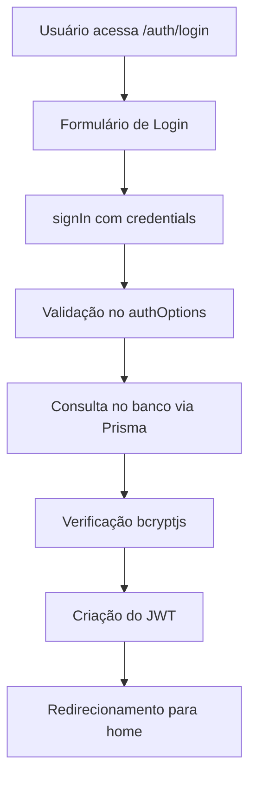
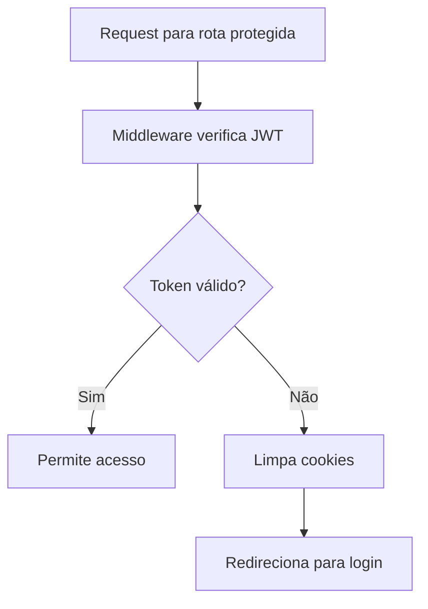

# NextAuth Implementation Guide

## Visão Geral

Este documento fornece uma referência completa da implementação do NextAuth.js no projeto, incluindo configuração, padrões de uso, componentes de proteção e sistema de permissões.

## Arquitetura da Autenticação

### 1. Configuração Principal

#### NextAuth Configuration (`/src/lib/auth.ts`)
```typescript
// Configuração centralizada do NextAuth
export const authOptions: NextAuthOptions = {
  providers: [CredentialsProvider],
  session: { strategy: "jwt" },
  callbacks: { jwt, session },
  pages: { signIn, error, signOut },
  events: { signOut }
}
```

**Características:**
- **Provider**: CredentialsProvider para autenticação email/senha
- **Estratégia**: JWT para sessões
- **Validação**: bcryptjs para hash de senhas
- **Database**: Prisma ORM para consultas de usuário
- **Auditoria**: Log de eventos de logout

#### API Route (`/src/app/api/auth/[...nextauth]/route.ts`)
```typescript
// Handler padrão do NextAuth
const handler = NextAuth(authOptions)
export { handler as GET, handler as POST }
```

### 2. Middleware de Autenticação

#### Middleware (`/src/middleware.ts`)
```typescript
// Proteção automática de rotas
export async function middleware(request: NextRequest) {
  // Verificação de token JWT
  // Redirecionamento baseado em autenticação
  // Limpeza de cookies inválidos
  // Headers de segurança
}
```

**Funcionalidades:**
- **Rotas Públicas**: `/auth/login`, `/api/auth/*`
- **Proteção Automática**: Todas as outras rotas
- **Redirecionamento**: Login para não autenticados
- **Segurança**: Headers CSP e CSRF

### 3. Hook de Autenticação

#### useAuth Hook (`/src/hooks/useAuth.ts`)
```typescript
export function useAuth() {
  const { data: session, status } = useSession()
  
  return {
    user, colaborador, permissions,
    hasPermission, hasAnyPermission, isAdmin,
    canAccess: { webmail: {...} }
  }
}
```

**Recursos:**
- **Estado da Sessão**: Loading, authenticated, unauthenticated
- **Dados do Usuário**: ID, email, colaborador
- **Permissões**: Verificação granular
- **Utilitários**: Funções de conveniência

## Componentes de Proteção

### 1. Protected Routes

#### ProtectedRoute (`/src/components/auth/ProtectedRoute.tsx`)
```typescript
// Proteção de rotas completas
<ProtectedRoute requiredPermissions={['admin']}>
  <AdminPanel />
</ProtectedRoute>

// Proteção de elementos específicos
<ProtectedElement requiredPermissions={['edit_users']}>
  <EditButton />
</ProtectedElement>
```

#### WebmailProtectedRoute (`/src/components/webmail/WebmailProtectedRoute.tsx`)
```typescript
// Proteção específica para webmail
<WebmailProtectedRoute requiredPermissions={['webmail_config']}>
  <WebmailSettings />
</WebmailProtectedRoute>
```

### 2. Layout Global

#### GlobalLayout (`/src/components/layout/GlobalLayout.tsx`)
```typescript
// Controle de layout baseado em autenticação
function GlobalLayout({ children }: GlobalLayoutProps) {
  const { isAuthenticated } = useAuth()
  
  // Redirecionamento automático
  // Layout condicional (com/sem sidebar)
}
```

## Sistema de Permissões

### 1. Permissões de Webmail

#### Estrutura (`/src/lib/permissions/webmail-permissions.ts`)
```typescript
export const WEBMAIL_PERMISSIONS = {
  CONFIG: 'webmail_config',
  EMAIL_READ: 'webmail_email_read',
  EMAIL_SEND: 'webmail_email_send',
  // ... outras permissões
}

export const WEBMAIL_ACCESS_LEVELS = {
  BASIC: ['webmail_email_read'],
  ADVANCED: ['webmail_email_read', 'webmail_email_send'],
  SUPERVISOR: [...ADVANCED, 'webmail_folder_manage'],
  ADMIN: [...SUPERVISOR, 'webmail_admin']
}
```

#### Hook de Permissões (`/src/hooks/useWebmailPermissions.ts`)
```typescript
export function useWebmailPermissions() {
  return {
    canConfig, canReadEmail, canSendEmail,
    canManageFolder, canSync, canManageAttachment,
    canAdmin, accessLevel
  }
}
```

### 2. Verificação de Permissões

#### Utilitários
```typescript
// Verificação individual
hasPermission('webmail_config')

// Verificação múltipla (qualquer uma)
hasAnyPermission(['webmail_config', 'admin'])

// Verificação de administrador
isAdmin()

// Acesso específico do webmail
canAccess.webmail.config
```

## Fluxos de Autenticação

### 1. Login Flow



### 2. Middleware Protection



### 3. Logout Flow

```mermaid
graph TD
    A[Usuário clica em Sair] --> B[performLogout()]
    B --> C[Limpa localStorage]
    C --> D[Limpa sessionStorage]
    D --> E[Limpa cookies]
    E --> F[signOut() do NextAuth]
    F --> G[Log de auditoria]
    G --> H[Redirecionamento para login]
```

## Configuração de Sessão

### 1. Session Provider

#### Setup (`/src/components/providers/session-provider.tsx`)
```typescript
'use client'
export function AuthSessionProvider({ children }: Props) {
  return (
    <SessionProvider>
      {children}
    </SessionProvider>
  )
}
```

#### Layout Integration (`/src/app/layout.tsx`)
```typescript
<AuthSessionProvider>
  <NotificationProvider>
    <GlobalLayout>
      {children}
    </GlobalLayout>
  </NotificationProvider>
</AuthSessionProvider>
```

### 2. Configuração de Ambiente

#### Variáveis Necessárias
```env
NEXTAUTH_SECRET=your-secret-key
NEXTAUTH_URL=http://localhost:3000
DATABASE_URL=your-database-url
```

## Padrões de Uso

### 1. Verificação de Autenticação

```typescript
// Em componentes
const { isAuthenticated, isLoading } = useAuth()

if (isLoading) return <Loading />
if (!isAuthenticated) return <LoginPrompt />

// Em páginas
const { user, hasPermission } = useAuth()

if (!hasPermission('required_permission')) {
  return <AccessDenied />
}
```

### 2. Proteção Condicional

```typescript
// Renderização condicional
{canAccess.webmail.config && (
  <WebmailConfigButton />
)}

// Componente wrapper
<ProtectedElement requiredPermissions={['admin']}>
  <AdminOnlyContent />
</ProtectedElement>
```

### 3. Redirecionamento Programático

```typescript
// No GlobalLayout
useEffect(() => {
  if (!isAuthenticated && !isPublicPage) {
    router.push('/auth/login')
  }
}, [isAuthenticated, pathname])
```

## Segurança

### 1. Headers de Segurança

O middleware adiciona automaticamente:
- Content Security Policy (CSP)
- X-Frame-Options
- X-Content-Type-Options
- Referrer-Policy

### 2. Proteção CSRF

- Tokens automáticos do NextAuth
- Verificação em todas as requisições POST

### 3. Validação de Sessão

- Verificação contínua de JWT
- Limpeza automática de sessões inválidas
- Timeout de sessão configurável

## Troubleshooting

### 1. Problemas Comuns

#### Sessão não persiste
- Verificar NEXTAUTH_SECRET
- Verificar configuração de cookies
- Verificar domínio da aplicação

#### Redirecionamento infinito
- Verificar rotas públicas no middleware
- Verificar configuração de páginas no authOptions

#### Permissões não funcionam
- Verificar estrutura do token JWT
- Verificar callback de sessão
- Verificar dados do usuário no banco

### 2. Debug

```typescript
// Habilitar logs do NextAuth
export const authOptions: NextAuthOptions = {
  debug: process.env.NODE_ENV === 'development',
  // ... outras configurações
}
```

## Extensões Futuras

### 1. Providers Adicionais
- OAuth (Google, GitHub, etc.)
- SAML para SSO corporativo
- LDAP/Active Directory

### 2. Funcionalidades Avançadas
- Two-Factor Authentication (2FA)
- Session management avançado
- Audit logs detalhados

### 3. Performance
- Cache de permissões
- Otimização de queries
- Session storage alternativo

---

**Última atualização:** $(date)
**Versão do NextAuth:** 4.24.11
**Compatibilidade:** Next.js 14+