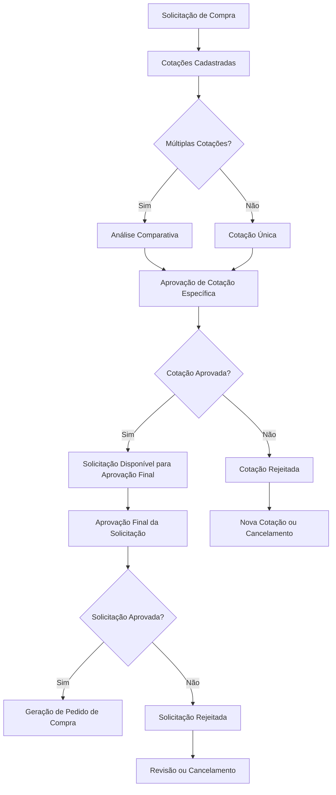
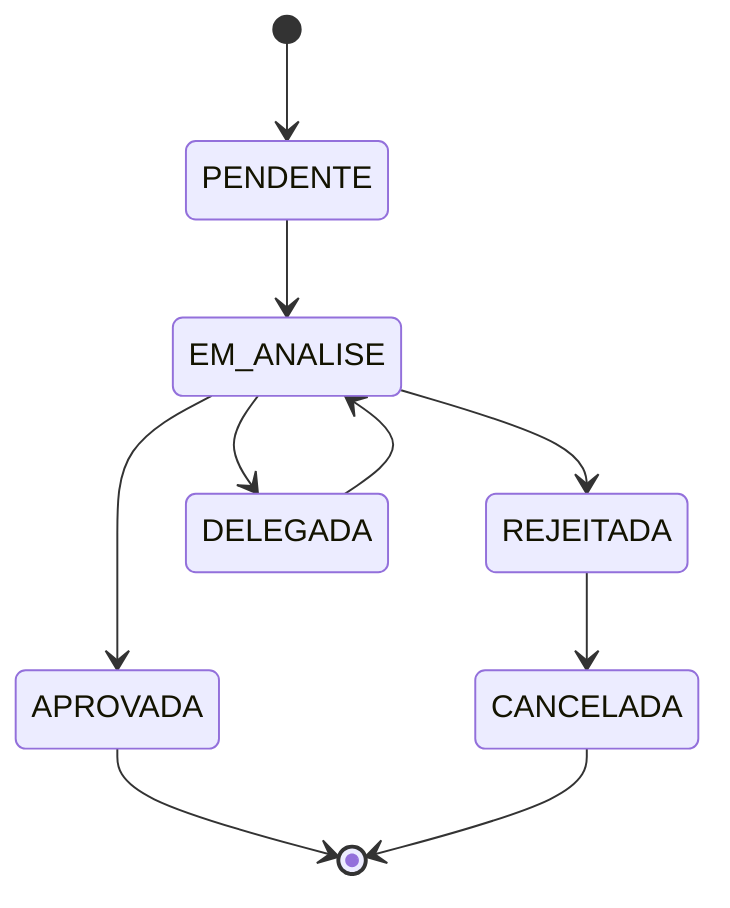

# Sistema de Aprovação de Cotações - Módulo de Compras

## 1. Visão Geral

O sistema de aprovação de cotações implementa um fluxo de aprovação em **duas etapas**:

1. **Aprovação de Cotação Específica**: Após o cadastro de múltiplas cotações, uma cotação específica deve ser aprovada
2. **Aprovação Final da Solicitação**: Após a aprovação da cotação, a solicitação de compra fica disponível para aprovação final

## 2. Fluxo Completo do Processo



## 3. Modelos de Dados Propostos

### 3.1 Novo Modelo: AprovacaoCotacao

```prisma
model AprovacaoCotacao {
  id              String    @id @default(cuid())
  
  // Cotação
  cotacaoId       String
  cotacao         Cotacao   @relation(fields: [cotacaoId], references: [id], onDelete: Cascade)
  
  // Proposta Específica (opcional - para aprovação de proposta específica)
  propostaId      String?
  proposta        PropostaFornecedor? @relation(fields: [propostaId], references: [id])
  
  // Aprovador
  aprovadorId     String
  aprovador       Usuario   @relation(fields: [aprovadorId], references: [id])
  
  // Nível de Aprovação
  nivel           Int       // Ordem de aprovação (1, 2, 3...)
  isObrigatorio   Boolean   @default(true)
  
  // Status
  status          StatusAprovacaoCotacao @default(PENDENTE)
  dataAprovacao   DateTime?
  dataRejeicao    DateTime?
  
  // Justificativas
  comentarios     String?
  motivoAprovacao String?   // Por que esta cotação foi escolhida
  motivoRejeicao  String?
  
  // Critérios de Avaliação
  criteriosAvaliacao Json?   // Pontuação por critério
  pontuacaoTotal  Decimal?
  
  // Comparativo
  analiseCusto    String?   // Análise de custo-benefício
  analiseQualidade String?  // Análise de qualidade
  analisePrazo    String?   // Análise de prazo
  
  // Metadados
  empresaId       String
  empresa         Empresa   @relation(fields: [empresaId], references: [id])
  
  createdAt       DateTime  @default(now())
  updatedAt       DateTime  @updatedAt
  
  @@map("aprovacoes_cotacao")
}
```

### 3.2 Novo Enum: StatusAprovacaoCotacao

```prisma
enum StatusAprovacaoCotacao {
  PENDENTE          // Aguardando aprovação
  EM_ANALISE        // Em análise pelo aprovador
  APROVADA          // Cotação aprovada
  REJEITADA         // Cotação rejeitada
  DELEGADA          // Aprovação delegada para outro usuário
  CANCELADA         // Processo cancelado
}
```

### 3.3 Atualização do Modelo Cotacao

```prisma
model Cotacao {
  // ... campos existentes ...
  
  // Novos campos para aprovação
  statusAprovacao StatusAprovacaoCotacao? @default(PENDENTE)
  dataAprovacao   DateTime?
  aprovadorId     String?
  aprovador       Usuario? @relation(fields: [aprovadorId], references: [id])
  
  // Relacionamentos
  aprovacoes      AprovacaoCotacao[]
  
  // ... resto dos campos existentes ...
}
```

### 3.4 Atualização do Modelo SolicitacaoCompra

```prisma
model SolicitacaoCompra {
  // ... campos existentes ...
  
  // Novos campos para controle de fluxo
  temCotacaoAprovada Boolean @default(false)
  cotacaoAprovadaId  String?
  cotacaoAprovada    Cotacao? @relation(fields: [cotacaoAprovadaId], references: [id])
  
  // ... resto dos campos existentes ...
}
```

## 4. Regras de Negócio

### 4.1 Aprovação de Cotação

1. **Múltiplas Cotações**: Quando há múltiplas cotações, apenas uma pode ser aprovada
2. **Cotação Única**: Cotação única deve ser aprovada antes da aprovação final
3. **Critérios de Avaliação**: 
   - Menor preço (peso: 40%)
   - Melhor prazo (peso: 30%)
   - Qualidade do fornecedor (peso: 20%)
   - Condições de pagamento (peso: 10%)

### 4.2 Níveis de Aprovação de Cotação

| Valor da Cotação | Nível Requerido | Aprovador |
|------------------|-----------------|-----------|
| Até R$ 1.000 | 1 | Supervisor |
| R$ 1.001 - R$ 10.000 | 2 | Gerente + Supervisor |
| R$ 10.001 - R$ 50.000 | 3 | Diretor + Gerente + Supervisor |
| Acima de R$ 50.000 | 4 | CEO + Diretor + Gerente + Supervisor |

### 4.3 Transições de Status



## 5. APIs e Endpoints

### 5.1 Aprovação de Cotações

```typescript
// Listar cotações pendentes de aprovação
GET /api/procurement/quotations/pending-approval

// Aprovar cotação específica
POST /api/procurement/quotations/[id]/approve
{
  "propostaId": "string",
  "comentarios": "string",
  "motivoAprovacao": "string",
  "criteriosAvaliacao": {
    "preco": 8.5,
    "prazo": 7.0,
    "qualidade": 9.0,
    "pagamento": 8.0
  }
}

// Rejeitar cotação
POST /api/procurement/quotations/[id]/reject
{
  "motivoRejeicao": "string",
  "comentarios": "string"
}

// Delegar aprovação
POST /api/procurement/quotations/[id]/delegate
{
  "novoAprovadorId": "string",
  "motivo": "string"
}

// Histórico de aprovações da cotação
GET /api/procurement/quotations/[id]/approval-history

// Comparativo de propostas
GET /api/procurement/quotations/[id]/proposals-comparison
```

### 5.2 Webhooks e Notificações

```typescript
// Webhook: Cotação aprovada
POST /webhooks/quotation-approved
{
  "cotacaoId": "string",
  "solicitacaoId": "string",
  "propostaAprovada": "string",
  "aprovadorId": "string",
  "timestamp": "datetime"
}

// Webhook: Cotação rejeitada
POST /webhooks/quotation-rejected
{
  "cotacaoId": "string",
  "solicitacaoId": "string",
  "motivoRejeicao": "string",
  "aprovadorId": "string",
  "timestamp": "datetime"
}
```

## 6. Componentes de Interface

### 6.1 Componentes Principais

```typescript
// Painel de aprovação de cotações
<ApprovalQuotationPanel />

// Comparativo de propostas
<ProposalsComparison cotacaoId={id} />

// Formulário de aprovação
<QuotationApprovalForm />

// Histórico de aprovações
<ApprovalHistory cotacaoId={id} />

// Dashboard de aprovações pendentes
<PendingApprovalsDashboard />
```

### 6.2 Telas Específicas

1. **Lista de Cotações Pendentes**: `/compras/cotacoes/aprovacao`
2. **Detalhes da Cotação**: `/compras/cotacoes/[id]/aprovar`
3. **Comparativo de Propostas**: `/compras/cotacoes/[id]/comparativo`
4. **Histórico de Aprovações**: `/compras/cotacoes/[id]/historico`

## 7. Permissões e Segurança

### 7.1 Roles Específicas

```typescript
enum RoleAprovacaoCotacao {
  APROVADOR_COTACAO_NIVEL_1 = "aprovador_cotacao_nivel_1"
  APROVADOR_COTACAO_NIVEL_2 = "aprovador_cotacao_nivel_2"
  APROVADOR_COTACAO_NIVEL_3 = "aprovador_cotacao_nivel_3"
  APROVADOR_COTACAO_NIVEL_4 = "aprovador_cotacao_nivel_4"
  VISUALIZADOR_APROVACOES = "visualizador_aprovacoes"
}
```

### 7.2 Matriz de Permissões

| Ação | Supervisor | Gerente | Diretor | CEO |
|------|------------|---------|---------|-----|
| Aprovar até R$ 1.000 | ✅ | ✅ | ✅ | ✅ |
| Aprovar R$ 1.001-10.000 | ❌ | ✅ | ✅ | ✅ |
| Aprovar R$ 10.001-50.000 | ❌ | ❌ | ✅ | ✅ |
| Aprovar > R$ 50.000 | ❌ | ❌ | ❌ | ✅ |
| Visualizar todas | ❌ | ✅ | ✅ | ✅ |
| Delegar aprovação | ✅ | ✅ | ✅ | ✅ |

## 8. Integrações

### 8.1 Módulo de Notificações
- Notificação para aprovadores quando cotação estiver pendente
- Notificação para solicitante quando cotação for aprovada/rejeitada
- Lembretes automáticos para aprovações pendentes

### 8.2 Módulo de Relatórios
- Relatório de tempo médio de aprovação de cotações
- Relatório de cotações por aprovador
- Análise de eficiência do processo de aprovação

### 8.3 Módulo de Dashboard
- Widget de cotações pendentes de aprovação
- Gráfico de aprovações por período
- Indicadores de performance do processo

## 9. Cronograma de Implementação

### Fase 1 (Semana 1-2): Modelos e Backend
- [ ] Criação dos novos modelos Prisma
- [ ] Implementação das APIs de aprovação
- [ ] Configuração de webhooks

### Fase 2 (Semana 3-4): Interface
- [ ] Componentes de aprovação
- [ ] Telas de comparativo
- [ ] Dashboard de aprovações

### Fase 3 (Semana 5): Integrações
- [ ] Integração com notificações
- [ ] Integração com relatórios
- [ ] Testes de integração

### Fase 4 (Semana 6): Testes e Validação
- [ ] Testes unitários
- [ ] Testes de fluxo completo
- [ ] Validação com usuários

## 10. Métricas de Sucesso

- **Tempo médio de aprovação**: < 2 dias úteis
- **Taxa de aprovação**: > 85%
- **Satisfação dos usuários**: > 4.5/5
- **Redução de retrabalho**: > 30%
- **Rastreabilidade**: 100% das decisões documentadas